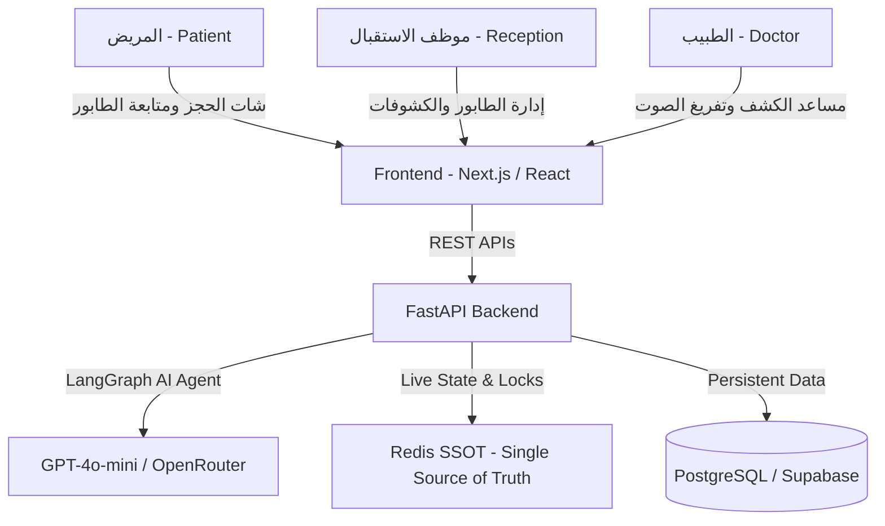

# 🏥 دليل التكامل الشامل لمطوري الواجهات الأمامية (Frontend Integration Guide)
## نظام "عيادتي" الذكي لإدارة العيادات والطوابير الفورية بالذكاء الاصطناعي
> **نسخة الدليل:** v1.0.0 — Production Ready  
> **موجّه إلى:** مهندس الواجهات الأمامية (Frontend Engineer / Full-Stack Developer)  
> **الهدف:** بناء وتطوير واجهات النظام بالكامل بالربط مع الـ Backend والـ AI Agents دون الحاجة لمعرفة مسبقة بكواليس السيرفر.

---

## 📑 فهرس المحتويات
1. [نظرة عامة على معمارية النظام (System Architecture)](#1-نظرة-عامة-على-معمارية-النظام)
2. [بيئة التشغيل والإعدادات الأساسية (Environment & Setup)](#2-بيئة-التشغيل-والإعدادات-الأساسية)
3. [مرجع الـ APIs بالتفصيل (Complete API Reference)](#3-مرجع-الـ-apis-بالتفصيل)
   - [3.1 شات الحجز الذكي (AI Chatbot)](#31-شات-الحجز-الذكي-ai-chatbot)
   - [3.2 تتبع مكان المريض في الطابور (Live Queue Position)](#32-تتبع-مكان-المريض-في-الطابور-live-queue-position)
   - [3.3 لوحة تحكم الاستقبال والطابور الكامل (Clinic Queue State)](#33-لوحة-تحكم-الاستقبال-والطابور-الكامل-clinic-queue-state)
   - [3.4 تسجيل وصول المريض (Patient Check-In)](#34-تسجيل-وصول-المريض-patient-check-in)
   - [3.5 بدء الكشف (Start Consultation)](#35-بدء-الكشف-start-consultation)
   - [3.6 إنهاء الكشف (Complete Consultation)](#36-إنهاء-الكشف-complete-consultation)
   - [3.7 تخطي / إلغاء مريض من الطابور (Skip / No-Show)](#37-تخطي--إلغاء-مريض-من-الطابور-skip--no-show)
4. [دليل الصفحات المطلوبة وتجربة المستخدم (UI/UX Blueprint)](#4-دليل-الصفحات-المطلوبة-وتجربة-المستخدم)
5. [قواعد العمل والحالات الاستثنائية (Business Rules & Edge Cases)](#5-قواعد-العمل-والحالات-الاستثنائية)
6. [نماذج أكواد جاهزة للنسخ واللصق (TypeScript & React Snippets)](#6-نماذج-أكواد-جاهزة-للنسخ-واللصق)

---

## 1. نظرة عامة على معمارية النظام

نظام "عيادتي" ينقسم إلى 3 أطراف رئيسية:



### أدوار المستخدمين (User Roles):
1. **المريض (Patient):**
   - يتحدث مع الشات بوت الذكي لحجز موعد، معرفة مكانه في الطابور، تعديل أو إلغاء موعد.
   - يدخل على صفحة الطابور الحي لمتابعة رقمه والوقت المتوقع لدخوله (ETA) بالدقائق بشكل لحظي.
2. **الاستقبال / العيادة (Reception / Clinic Admin):**
   - يرى لوحة تحكم حية للطابور: (الرقم الحالي عند الدكتور، إجمالي المنتظرين، متوسط وقت الكشف).
   - يتحكم في سير الطابور: `بدء الكشف ▶️`، `إنهاء الكشف ⏹️`، `تخطي مريض لم يحضر ⏭️`.

---

## 2. بيئة التشغيل والإعدادات الأساسية

### عناوين الخادم والتوثيق التفاعلي (Base URLs & Interactive Docs):
- **الخادم السحابي الحي (Live Production API):** `https://3eyadaty-api.up.railway.app` 🌍
- **الخادم المحلي (Local API):** `http://localhost:8000`
- **واجهة تجربة الـ APIs التفاعلية الحية (Live Interactive Swagger UI):** `https://3eyadaty-api.up.railway.app/docs` 🚀
- **توثيق ReDoc المتقدم:** `https://3eyadaty-api.up.railway.app/redoc`
- **الترويسات الإجبارية (Headers):**
  ```http
  Content-Type: application/json
  ```

### المعرفات الافتراضية للتجربة (Default Sandbox IDs):
- `clinic_id`: `"default-clinic"`
- `doctor_id`: `"default-doctor"`
- `patient_id`: `"default-patient"`

---

## 3. مرجع الـ APIs بالتفصيل

---

### 3.1 شات الحجز الذكي (AI Chatbot)
المحرك الرئيسي للمحادثة بين المريض والمساعد الذكي. يتولى الحجز التلقائي، الاستعلام عن الطابور، الإلغاء، والتعديل.

* **المسار:** `POST /api/v1/chat`
* **متى يُستخدم؟** عند إرسال المريض أي رسالة نصية في الشات.

#### 📤 Request Body:
```json
{
  "message": "عايز احجز موعد بكره الساعة 12 الضهر ورقم تليفوني 01284709314",
  "clinic_id": "default-clinic",
  "thread_id": "c95eb62c-3891-4d1a-9694-8178a9c3fb45",
  "patient_phone": "01284709314"
}
```

| الحقل | النوع | إجباري؟ | الوصف |
| :--- | :--- | :---: | :--- |
| `message` | `string` | نعم | نص رسالة المستخدم بالعامية أو الفصحى |
| `clinic_id` | `string` | نعم | معرف العيادة (استخدم `default-clinic`) |
| `thread_id` | `string \| null` | لا | معرف المحادثة (أرسله `null` في أول رسالة، ثم احتفظ بالقيمة العائدة وأرسلها في كل الرسائل التالية) |
| `patient_phone` | `string \| null` | لا | رقم الهاتف إذا كان معروفاً لديك في الـ State (للحفاظ على ثبات الجلسة) |

#### 📥 Success Response (200 OK):
```json
{
  "response": "تم حجز موعدك بنجاح! 🎉\n- التاريخ: 2026-08-30\n- الساعة: 12:00 ظهرًا\n- رقمك في الطابور: 1",
  "thread_id": "c95eb62c-3891-4d1a-9694-8178a9c3fb45",
  "intent": "booking",
  "data": {
    "patient_phone": "01284709314",
    "appointment_id": "dcff149e-3151-4fbb-91bb-a578a3c8de81",
    "queue_number": 1
  }
}
```

> **💡 تنبيه هام للفرونت إند:**
> 1. بمجرد استلام `thread_id` احفظه في الـ `React State` أو `sessionStorage` ومرره في كل الـ Requests القادمة حتى لا ينسى الذكاء الاصطناعي سياق المحادثة.
> 2. إذا أعاد السيرفر `data.patient_phone`، احفظه ومرره في الـ Requests التالية.
> 3. إذا أعاد السيرفر `data.appointment_id` و `data.queue_number`، يمكنك إظهار شارة (Badge) في الشات تنقل المريض مباشرة لصفحة تتبع الطابور `/queue`.

---

### 3.2 تتبع مكان المريض في الطابور (Live Queue Position)
جلب موقع مريض محدد في الطابور المباشر والوقت المتوقع لانتظاره.

* **المسار:** `GET /api/v1/queue/position/{clinic_id}/{doctor_id}/{appointment_id}`
* **متى يُستخدم؟** في صفحة `/queue` لعمل Polling دوري (كل 5 إلى 10 ثوانٍ) لتحديث رقم الدور للمريض.

#### 📤 Parameters:
- `clinic_id` (Path): `default-clinic`
- `doctor_id` (Path): `default-doctor`
- `appointment_id` (Path): المعرف الفريد للحجز (UUID)
- `queue_date` (Query - اختياري): تاريخ اليوم بصيغة `YYYY-MM-DD` (الافتراضي هو اليوم الحالي)

#### 📥 Success Response (200 OK):
```json
{
  "queue_number": 4,
  "current_serving": 2,
  "patients_ahead": 2,
  "total_in_queue": 8,
  "avg_consultation_minutes": 20,
  "estimated_wait_minutes": 40
}
```

| الحقل العائد | المعنى | كيفية عرضه في الواجهة |
| :--- | :--- | :--- |
| `queue_number` | رقم دور هذا المريض | "رقمك: #4" (بطاقة بارزة) |
| `current_serving` | رقم المريض الموجود داخل غرفة الطبيب الآن | "الكشف الحالي: رقم 2" |
| `patients_ahead` | عدد المرضى المتبقين قبل هذا المريض | "فاضل قبلك: 2 مرضى" |
| `total_in_queue` | إجمالي الحالات المسجلة اليوم | "إجمالي الطابور: 8 حالات" |
| `avg_consultation_minutes` | متوسط مدة الكشف الفعلي المحسوب تلقائياً | "متوسط الكشف: 20 دقيقة" |
| `estimated_wait_minutes` | الوقت التقديري المتبقي بالدقائق (ETA) | "الوقت المتوقع: 40 دقيقة" |

#### 📥 Error Response (404 Not Found):
```json
{
  "detail": "المريض مش في الطابور"
}
```

---

### 3.3 لوحة تحكم الاستقبال والطابور الكامل (Clinic Queue State)
جلب حالة الطابور الكاملة لعيادة وطبيب معين.

* **المسار:** `GET /api/v1/queue/state/{clinic_id}/{doctor_id}`
* **متى يُستخدم؟** في لوحة تحكم موظف الاستقبال `/clinic` لعرض كل الحالات وقائمة الانتظار.

#### 📥 Success Response (200 OK):
```json
{
  "entries": [
    { "appointment_id": "dcff149e-...", "queue_number": 1 },
    { "appointment_id": "97bfb3c5-...", "queue_number": 2 },
    { "appointment_id": "201986b9-...", "queue_number": 3 }
  ],
  "current_serving": 1,
  "total": 3,
  "avg_consultation_minutes": 25
}
```

---

### 3.4 تسجيل وصول المريض (Patient Check-In)
عندما يصل المريض للعيادة، يقوم الريسبشن أو المريض عبر QR Code بتسجيل الوصول لدخول الطابور النشط.

* **المسار:** `POST /api/v1/queue/check-in/{appointment_id}?clinic_id=default-clinic&doctor_id=default-doctor`

#### 📥 Success Response (200 OK):
```json
{
  "message": "تم تسجيل الوصول ✅",
  "queue_number": 5,
  "appointment_id": "dcff149e-..."
}
```

---

### 3.5 بدء الكشف (Start Consultation)
عندما ينادي الطبيب أو الريسبشن على المريض للدخول لغرفة الكشف.

* **المسار:** `POST /api/v1/queue/start/{appointment_id}?clinic_id=default-clinic&doctor_id=default-doctor&queue_number=3`

#### 📥 Success Response (200 OK):
```json
{
  "message": "الكشف بدأ ▶️",
  "queue_number": 3
}
```
*(هذا الاستدعاء يقوم فوراً بتحديث `current_serving = 3` لجميع المرضى المتصلين).*

---

### 3.6 إنهاء الكشف (Complete Consultation)
عند خروج المريض من غرفة الكشف وتسجيل مدة الكشف الفعلية.

* **المسار:** `POST /api/v1/queue/complete/{appointment_id}?clinic_id=default-clinic&doctor_id=default-doctor&duration_minutes=25`

#### 📥 Success Response (200 OK):
```json
{
  "message": "الكشف انتهى ⏹️",
  "duration_minutes": 25
}
```
*(يقوم السيرفر بحذف المريض من الطابور وإعادة حساب المعدل التراكمي للوقت `Rolling Average` وتحديث الـ ETA تلقائياً).*

---

### 3.7 تخطي / إلغاء مريض من الطابور (Skip / No-Show)
إذا تم المناداة على المريض ولم يحضر أو اعتذر عن الحضور، يقوم الريسبشن بحذفه من الطابور.

* **المسار:** `POST /api/v1/queue/cancel/{appointment_id}?clinic_id=default-clinic&doctor_id=default-doctor`

#### 📥 Success Response (200 OK):
```json
{
  "message": "تم الإزالة من الطابور ❌"
}
```

---

### 3.8 جلب وتعديل المواعيد يدوياً (Appointments CRUD APIs)

#### 1. جلب قائمة المواعيد للعيادة (List Appointments):
* **المسار:** `GET /api/v1/appointments/{clinic_id}?date=2026-09-01&doctor_id=default-doctor`
* **الاستخدام:** في جدول المواعيد في لوحة تحكم الريسبشن.

#### 📥 Success Response (200 OK):
```json
[
  {
    "id": "dcff149e-3151-4fbb-91bb-a578a3c8de81",
    "patient_phone": "01284709314",
    "doctor_id": "default-doctor",
    "clinic_id": "default-clinic",
    "date": "2026-09-01",
    "time": "12:00",
    "status": "scheduled",
    "queue_number": 1,
    "created_at": "2026-08-29T02:00:00.000Z"
  }
]
```

---

#### 2. تعديل حالة موعد يدوياً (Update Appointment Status):
* **المسار:** `PATCH /api/v1/appointments/{appointment_id}/status`

#### 📤 Request Body:
```json
{
  "status": "completed",
  "cancellation_reason": null
}
```

#### 📥 Success Response (200 OK):
```json
{
  "appointment_id": "dcff149e-3151-4fbb-91bb-a578a3c8de81",
  "status": "completed"
}
```

#### 📋 1. كائن الحجز الكامل (Appointment Entity):
```json
{
  "id": "dcff149e-3151-4fbb-91bb-a578a3c8de81",
  "patient_phone": "01284709314",
  "patient_name": "أحمد محمود",
  "patient_id": "default-patient",
  "doctor_id": "default-doctor",
  "clinic_id": "default-clinic",
  "date": "2026-09-01",
  "time": "12:00",
  "status": "scheduled",
  "queue_number": 1,
  "notes": "كشف باطنة وجهاز هضمي",
  "created_at": "2026-08-29T02:00:00.000Z"
}
```

> **قيم الـ `status` المحتملة:**
> - `"scheduled"`: موعد محجوز مؤكد.
> - `"checked_in"`: وصل المريض العيادة وموجود في الطابور المباشر.
> - `"in_progress"`: المريض حالياً داخل غرفة الكشف عند الطبيب.
> - `"completed"`: انتهى الكشف.
> - `"cancelled"`: تم إلغاء الحجز.

---

#### 👨‍⚕️ 2. كائن الطبيب (Doctor Entity):
```json
{
  "id": "default-doctor",
  "name": "د. أحمد حسام",
  "specialty": "استشاري الباطنة والجهاز الهضمي",
  "clinic_id": "default-clinic",
  "consultation_duration_minutes": 20,
  "working_hours": {
    "start": "09:00",
    "end": "17:00",
    "off_days": [4]
  }
}
```

---

#### 🏥 3. كائن العيادة (Clinic Entity):
```json
{
  "id": "default-clinic",
  "name": "عيادات النخبة التخصصية",
  "address": "شارع التسعين الشمالي، التجمع الخامس، القاهرة",
  "phone": "0225566778"
}
```

---

### 3.9 أشكال ردود الأخطاء وحالات التحذير (Error & Warning Payloads)

#### 1. عند محاولة حجز موعد محجوز بالفعل لمريض آخر (`slot_taken`):
```json
{
  "success": false,
  "error": "slot_taken",
  "message": "عفواً، الموعد الساعة 12:00 يوم 2026-09-01 محجوز بالفعل! يرجى اختيار موعد متاح آخر."
}
```

#### 2. عند محاولة الحجز في يوم إجازة العيادة الجمعة (`off_day`):
```json
{
  "success": false,
  "error": "off_day",
  "message": "العيادة في إجازة أسبوعية رسمية يوم الجمعة (2026-09-04). أقرب يوم عمل متاح هو السبت (2026-09-05)."
}
```

#### 3. عند محاولة حجز أكثر من موعد لنفس المريض في نفس اليوم (`already_booked_today`):
```json
{
  "success": false,
  "error": "already_booked_today",
  "message": "لديك حجز نشط بالفعل يوم 2026-09-01 الساعة 10:00. لا يمكن حجز أكثر من موعد في نفس اليوم لنفس المريض. يمكنك تعديل موعدك الحالي إذا أردت.",
  "existing_appointment": {
    "id": "dcff149e-...",
    "date": "2026-09-01",
    "time": "10:00",
    "queue_number": 1
  }
}
```

#### 4. عند محاولة الحجز في تاريخ ماضٍ أو وقت قد انقضى اليوم (`past_date` / `past_time`):
```json
{
  "success": false,
  "error": "past_date",
  "message": "عفواً، لا يمكن حجز موعد في تاريخ ماضٍ (2025-01-01). يرجى اختيار موعد قادم ابتداءً من اليوم."
}
```

#### 5. عند محاولة إلغاء حجز مريض آخر (`unauthorized`):
```json
{
  "success": false,
  "error": "unauthorized",
  "message": "غير مصرح لك بإلغاء أو تعديل حجز لا يخص رقم هاتفك المسجل."
}
```

---

## 4. دليل الصفحات المطلوبة وتجربة المستخدم

| الصفحة | المسار المقترح (Route) | المكونات المطلوبة (UI Components) | الـ APIs المستخدمة |
| :--- | :--- | :--- | :--- |
| **الصفحة الرئيسية (Landing)** | `/` | Hero Section، ميزات النظام، إحصائيات سريعة، زر حجز ينقل لـ `/chat`. | ثابتة |
| **شات المساعد الذكي (AI Chat)** | `/chat` | صندوق رسائل، مؤشر كتابة (Typing Indicator)، أزرار اقتراحات سريعة، شارة الحجز المؤكد. | `POST /api/v1/chat` |
| **تتبع الطابور الحي للمريض** | `/queue` | كارت رقم الدور، كارت الدور الحالي، شريط تقدم نسبة الانتظار (Progress Bar)، بطاقة الوقت المتبقي (ETA). | `GET /api/v1/queue/position/...` |
| **لوحة تحكم الريسبشن** | `/clinic` | جدول الحالات، أزرار التحكم `(الكشف التالي، بدء، إنهاء، تخطي)`، إحصائيات اليوم. | `GET /api/v1/queue/state/...`<br>`POST /api/v1/queue/start/...`<br>`POST /api/v1/queue/complete/...` |

---

## 5. قواعد العمل والحالات الاستستنائية

يجب على مطور الواجهات معرفة هذه القواعد لضمان تجربة مستخدم سلسة وخالية من الأخطاء:

1. **صيغة التواريخ والأوقات:**
   - التواريخ دائماً بصيغة `YYYY-MM-DD` (مثال: `2026-09-01`).
   - الأوقات بصيغة 24 ساعة `HH:MM` (مثال: `09:30`, `14:00`).
2. **ساعات العمل الرسمية:**
   - العيادة تعمل يومياً من `09:00` صباحاً حتى `17:00` مساءً (كشف كل 30 دقيقة).
   - يوم الجمعة هو إجازة أسبوعية رسمية (لو طلب المريض الجمعة، الشات بوت سيعتذر ويقترح السبت).
3. **حظر الحجز المزدوج في نفس اليوم (Anti-Spam):**
   - لا يمكن لنفس رقم الهاتف حجز أكثر من موعد واحد نشط في نفس اليوم لنفس الطبيب.
4. **حفظ حالة الشات (State Persistence):**
   - يجب تخزين `thread_id` و `patient_phone` في الـ `localStorage` أو `State` حتى لا تضيع المحادثة عند عمل Refresh للصفحة.
5. **تحديث الطابور (Live Polling):**
   - في صفحة `/queue`، قم بعمل `setInterval` لجلب حالة الطابور كل 5 إلى 10 ثوانٍ ليعكس حركة الطابور المباشرة.

---

## 6. نماذج أكواد جاهزة للنسخ واللصق

### 📁 `types/api.ts` (تعريفات TypeScript كاملة):

```typescript
// ==================== CHAT TYPES ====================
export interface ChatRequest {
  message: string;
  clinic_id: string;
  thread_id?: string | null;
  patient_phone?: string | null;
}

export interface ChatResponse {
  response: string;
  thread_id: string;
  intent?: string;
  data?: {
    patient_phone?: string;
    appointment_id?: string;
    queue_number?: number;
    [key: string]: any;
  } | null;
}

// ==================== QUEUE TYPES ====================
export interface PatientQueuePosition {
  queue_number: number;
  current_serving: number;
  patients_ahead: number;
  total_in_queue: number;
  avg_consultation_minutes: number;
  estimated_wait_minutes: number;
}

export interface QueueEntry {
  appointment_id: string;
  queue_number: number;
}

export interface ClinicQueueState {
  entries: QueueEntry[];
  current_serving: number;
  total: number;
  avg_consultation_minutes: number;
}
```

---

### 📁 `services/api.ts` (عميل استدعاء الـ APIs):

```typescript
import { ChatRequest, ChatResponse, PatientQueuePosition, ClinicQueueState } from "../types/api";

const API_BASE_URL = process.env.NEXT_PUBLIC_API_URL || "http://localhost:8000";

export const clinicApi = {
  // 1. Send Message to AI Agent
  sendMessage: async (payload: ChatRequest): Promise<ChatResponse> => {
    const res = await fetch(`${API_BASE_URL}/api/v1/chat`, {
      method: "POST",
      headers: { "Content-Type": "application/json" },
      body: JSON.stringify(payload),
    });
    if (!res.ok) throw new Error(`Chat API Error: ${res.statusText}`);
    return res.json();
  },

  // 2. Get Patient Queue Position
  getPatientQueuePosition: async (
    clinicId: string,
    doctorId: string,
    appointmentId: string
  ): Promise<PatientQueuePosition> => {
    const res = await fetch(
      `${API_BASE_URL}/api/v1/queue/position/${clinicId}/${doctorId}/${appointmentId}`
    );
    if (!res.ok) throw new Error("Patient not in queue or appointment not found");
    return res.json();
  },

  // 3. Get Full Clinic Queue State (Reception Dashboard)
  getClinicQueueState: async (clinicId: string, doctorId: string): Promise<ClinicQueueState> => {
    const res = await fetch(`${API_BASE_URL}/api/v1/queue/state/${clinicId}/${doctorId}`);
    if (!res.ok) throw new Error("Failed to fetch clinic queue state");
    return res.json();
  },

  // 4. Start Next Consultation
  startConsultation: async (clinicId: string, doctorId: string, appointmentId: string, queueNumber: number) => {
    const res = await fetch(
      `${API_BASE_URL}/api/v1/queue/start/${appointmentId}?clinic_id=${clinicId}&doctor_id=${doctorId}&queue_number=${queueNumber}`,
      { method: "POST" }
    );
    return res.json();
  },

  // 5. Complete Consultation
  completeConsultation: async (clinicId: string, doctorId: string, appointmentId: string, durationMinutes: number) => {
    const res = await fetch(
      `${API_BASE_URL}/api/v1/queue/complete/${appointmentId}?clinic_id=${clinicId}&doctor_id=${doctorId}&duration_minutes=${durationMinutes}`,
      { method: "POST" }
    );
    return res.json();
  },
};
```

---

### 📁 `hooks/useLiveQueue.ts` (React Hook لتحديث الطابور لحظياً):

```typescript
import { useState, useEffect } from "react";
import { clinicApi } from "../services/api";
import { PatientQueuePosition } from "../types/api";

export function useLiveQueue(
  clinicId: string = "default-clinic",
  doctorId: string = "default-doctor",
  appointmentId: string | null,
  pollIntervalMs: number = 6000
) {
  const [queueData, setQueueData] = useState<PatientQueuePosition | null>(null);
  const [loading, setLoading] = useState<boolean>(true);
  const [error, setError] = useState<string | null>(null);

  useEffect(() => {
    if (!appointmentId) {
      setLoading(false);
      return;
    }

    let isMounted = true;

    const fetchPosition = async () => {
      try {
        const data = await clinicApi.getPatientQueuePosition(clinicId, doctorId, appointmentId);
        if (isMounted) {
          setQueueData(data);
          setError(null);
        }
      } catch (err: any) {
        if (isMounted) setError(err.message || "Failed to load queue position");
      } finally {
        if (isMounted) setLoading(false);
      }
    };

    // Initial fetch
    fetchPosition();

    // Auto-polling interval
    const interval = setInterval(fetchPosition, pollIntervalMs);

    return () => {
      isMounted = false;
      clearInterval(interval);
    };
  }, [clinicId, doctorId, appointmentId, pollIntervalMs]);

  return { queueData, loading, error };
}
```

---

### 📁 `hooks/useChat.ts` (React Hook لإدارة الشات والذاكرة):

```typescript
import { useState } from "react";
import { clinicApi } from "../services/api";

export interface ChatMessage {
  id: string;
  sender: "user" | "bot";
  text: string;
  timestamp: Date;
  data?: any;
}

export function useChat(clinicId: string = "default-clinic") {
  const [messages, setMessages] = useState<ChatMessage[]>([]);
  const [threadId, setThreadId] = useState<string | null>(null);
  const [patientPhone, setPatientPhone] = useState<string | null>(null);
  const [isLoading, setIsLoading] = useState<boolean>(false);

  const sendMessage = async (text: string) => {
    if (!text.trim() || isLoading) return;

    // 1. Append user message
    const userMsg: ChatMessage = {
      id: Date.now().toString(),
      sender: "user",
      text: text.trim(),
      timestamp: new Date(),
    };
    setMessages((prev) => [...prev, userMsg]);
    setIsLoading(true);

    try {
      // 2. Call API
      const res = await clinicApi.sendMessage({
        message: text.trim(),
        clinic_id: clinicId,
        thread_id: threadId,
        patient_phone: patientPhone,
      });

      // 3. Update State
      if (res.thread_id) setThreadId(res.thread_id);
      if (res.data?.patient_phone) setPatientPhone(res.data.patient_phone);

      // 4. Append Bot message
      const botMsg: ChatMessage = {
        id: (Date.now() + 1).toString(),
        sender: "bot",
        text: res.response,
        timestamp: new Date(),
        data: res.data,
      };
      setMessages((prev) => [...prev, botMsg]);
    } catch (error) {
      setMessages((prev) => [
        ...prev,
        {
          id: (Date.now() + 1).toString(),
          sender: "bot",
          text: "عفواً، حصل خطأ في الاتصال بالسيرفر. حاول مرة تانية.",
          timestamp: new Date(),
        },
      ]);
    } finally {
      setIsLoading(false);
    }
  };

  return { messages, sendMessage, isLoading, threadId, patientPhone };
}
```

---

## 🎯 ملخص سريع لصديقك مطور الويب:
1. شغل الباك إند: `uvicorn app.main:app --port 8000`.
2. كل الـ Endpoints موثقة بالأعلى بالـ Request والـ Response والـ Types.
3. ملف `useChat.ts` و `useLiveQueue.ts` يحتويان على اللوجيك كاملاً؛ يحتاج فقط لبناء التصميم (UI/Tailwind) واستدعاء الدوال! 🚀
