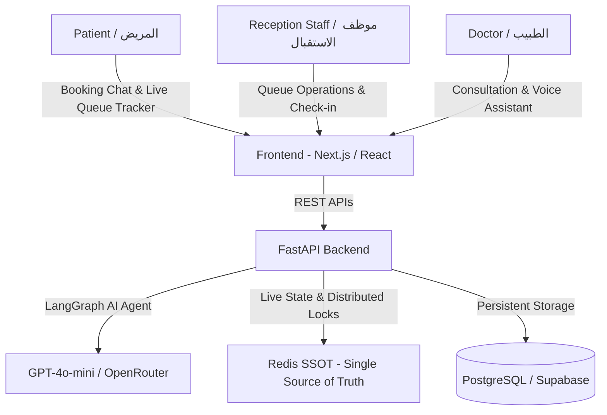

# 🏥 Comprehensive Frontend Integration & API Guide
## "3eyadaty" (عيادتي) — Intelligent AI-Powered Clinic Management & Live Queue System
> **Document Version:** v1.0.0 — Production Ready  
> **Target Audience:** Frontend Engineer / Full-Stack Developer  
> **Objective:** Complete reference for building, styling, and integrating the entire UI/UX with the FastAPI Backend and LangGraph AI Agents without needing prior backend knowledge.

---

## 📑 Table of Contents
1. [System Architecture & Overview](#1-system-architecture--overview)
2. [Environment Configuration & Base URLs](#2-environment-configuration--base-urls)
3. [Complete API Reference](#3-complete-api-reference)
   - [3.1 AI Booking Assistant (`POST /api/v1/chat`)](#31-ai-booking-assistant-post-apiv1chat)
   - [3.2 Live Queue Position Tracker (`GET /api/v1/queue/position/...`)](#32-live-queue-position-tracker-get-apiv1queueposition)
   - [3.3 Reception Full Queue State (`GET /api/v1/queue/state/...`)](#33-reception-full-queue-state-get-apiv1queuestate)
   - [3.4 Patient Arrival Check-In (`POST /api/v1/queue/check-in/...`)](#34-patient-arrival-check-in-post-apiv1queuecheck-in)
   - [3.5 Start Consultation (`POST /api/v1/queue/start/...`)](#35-start-consultation-post-apiv1queuestart)
   - [3.6 Complete Consultation (`POST /api/v1/queue/complete/...`)](#36-complete-consultation-post-apiv1queuecomplete)
   - [3.7 Skip / Cancel from Queue (`POST /api/v1/queue/cancel/...`)](#37-skip--cancel-from-queue-post-apiv1queuecancel)
   - [3.8 Appointments CRUD APIs (`GET & PATCH /api/v1/appointments/...`)](#38-appointments-crud-apis-get--patch-apiv1appointments)
   - [3.9 Entity Data Models (Appointment, Doctor, Clinic)](#39-entity-data-models)
   - [3.10 Error & Warning Payloads Schema](#310-error--warning-payloads-schema)
4. [UI/UX Pages Blueprint](#4-uiux-pages-blueprint)
5. [Business Rules & Logic Edge Cases](#5-business-rules--logic-edge-cases)
6. [Ready-to-Use TypeScript & React Code Snippets](#6-ready-to-use-typescript--react-code-snippets)

---

## 1. System Architecture & Overview

The system connects three distinct user personas through a unified reactive backend:



### User Roles & Personas:
1. **Patient (المريض):**
   - Interacts with the AI Assistant Chatbot to book appointments, check queue position, reschedule, or cancel.
   - Accesses the Live Queue Tracker page (`/queue`) to monitor their position and real-time dynamic ETA.
2. **Receptionist / Clinic Staff (موظف الاستقبال):**
   - Uses the Clinic Dashboard (`/clinic`) to oversee the live queue, call next patients, start/finish consultations, and handle no-shows.
3. **Doctor (الطبيب):**
   - Accesses the consultation portal (`/doctor`) for live consultation notes and automated prescription generation.

---

## 2. Environment Configuration & Base URLs

### Base URLs & Interactive Documentation:
- **Local API Base URL:** `http://localhost:8000`
- **Interactive Swagger UI (Try APIs in Browser):** `http://localhost:8000/docs` 🚀
- **ReDoc Documentation:** `http://localhost:8000/redoc`
- **Required Headers:**
  ```http
  Content-Type: application/json
  ```

### Default Sandbox IDs (For Testing):
- `clinic_id`: `"default-clinic"`
- `doctor_id`: `"default-doctor"`
- `patient_id`: `"default-patient"`

---

## 3. Complete API Reference

---

### 3.1 AI Booking Assistant (`POST /api/v1/chat`)
The primary conversational endpoint powered by the LangGraph Supervisor Agent. It handles automated booking, slot availability checks, queue inquiries, cancellations, and rescheduling.

* **Method & Path:** `POST /api/v1/chat`
* **When to call?** On every user message submitted in the chat interface.

#### 📤 Request Body:
```json
{
  "message": "عايز احجز موعد بكره الساعة 12 الضهر ورقم تليفوني 01284709314",
  "clinic_id": "default-clinic",
  "thread_id": "c95eb62c-3891-4d1a-9694-8178a9c3fb45",
  "patient_phone": "01284709314"
}
```

| Field | Type | Required? | Description |
| :--- | :--- | :---: | :--- |
| `message` | `string` | Yes | The user's input text (supports Egyptian Arabic dialect and standard Arabic). |
| `clinic_id` | `string` | Yes | UUID or identifier of the clinic (default: `default-clinic`). |
| `thread_id` | `string \| null` | No | Conversation thread identifier. Pass `null` on the first message, then save the returned `thread_id` and pass it in all subsequent requests to preserve memory context. |
| `patient_phone` | `string \| null` | No | Patient's phone number if already known in frontend state. |

#### 📥 Success Response (200 OK):
```json
{
  "response": "تم حجز موعدك بنجاح! 🎉\n- التاريخ: 2026-08-30\n- الساعة: 12:00 ظهرًا\n- رقمك في الطابور: 1",
  "thread_id": "c95eb62c-3891-4d1a-9694-8178a9c3fb45",
  "intent": "booking",
  "data": {
    "patient_phone": "01284709314",
    "appointment_id": "dcff149e-3151-4fbb-91bb-a578a3c8de81",
    "queue_number": 1
  }
}
```

> **💡 Critical Frontend Implementation Tip:**
> 1. Always retain `thread_id` in React State or `sessionStorage` and send it with every message so the AI agent never forgets multi-turn conversation context.
> 2. When `data.appointment_id` and `data.queue_number` are returned, display an action badge in the chat allowing the patient to navigate directly to `/queue`.

---

### 3.2 Live Queue Position Tracker (`GET /api/v1/queue/position/...`)
Fetches the real-time queue position, current serving number, and dynamic ETA for a specific patient.

* **Method & Path:** `GET /api/v1/queue/position/{clinic_id}/{doctor_id}/{appointment_id}`
* **When to call?** In the `/queue` page via periodic polling (every 5 to 10 seconds).

#### 📤 Path & Query Parameters:
- `clinic_id` (Path): `default-clinic`
- `doctor_id` (Path): `default-doctor`
- `appointment_id` (Path): Unique UUID of the appointment.
- `queue_date` (Query - Optional): Date formatted as `YYYY-MM-DD` (defaults to current date).

#### 📥 Success Response (200 OK):
```json
{
  "queue_number": 4,
  "current_serving": 2,
  "patients_ahead": 2,
  "total_in_queue": 8,
  "avg_consultation_minutes": 20,
  "estimated_wait_minutes": 40
}
```

| Response Field | Meaning | UI Display Recommendation |
| :--- | :--- | :--- |
| `queue_number` | Patient's queue ticket number | Big prominent badge: `#4` |
| `current_serving` | Queue number currently in the doctor's room | `"Currently with Doctor: #2"` |
| `patients_ahead` | Number of patients remaining ahead in line | `"2 patients ahead of you"` |
| `total_in_queue` | Total patients in today's active queue | `"Total in Queue: 8"` |
| `avg_consultation_minutes` | Rolling average duration per consultation | `"Average Consultation: 20 min"` |
| `estimated_wait_minutes` | Dynamic real-time ETA in minutes | Badge: `"Estimated Wait: ~40 mins"` |

#### 📥 Error Response (404 Not Found):
```json
{
  "detail": "المريض مش في الطابور"
}
```

---

### 3.3 Reception Full Queue State (`GET /api/v1/queue/state/...`)
Retrieves the complete live queue roster for the clinic dashboard.

* **Method & Path:** `GET /api/v1/queue/state/{clinic_id}/{doctor_id}`
* **When to call?** In the reception dashboard (`/clinic`) to render the full waiting list.

#### 📥 Success Response (200 OK):
```json
{
  "entries": [
    { "appointment_id": "dcff149e-...", "queue_number": 1 },
    { "appointment_id": "97bfb3c5-...", "queue_number": 2 },
    { "appointment_id": "201986b9-...", "queue_number": 3 }
  ],
  "current_serving": 1,
  "total": 3,
  "avg_consultation_minutes": 25
}
```

---

### 3.4 Patient Arrival Check-In (`POST /api/v1/queue/check-in/...`)
Registers a patient's arrival at the clinic (via reception desk or QR code scan).

* **Method & Path:** `POST /api/v1/queue/check-in/{appointment_id}?clinic_id=default-clinic&doctor_id=default-doctor`

#### 📥 Success Response (200 OK):
```json
{
  "message": "تم تسجيل الوصول ✅",
  "queue_number": 5,
  "appointment_id": "dcff149e-..."
}
```

---

### 3.5 Start Consultation (`POST /api/v1/queue/start/...`)
Called when the doctor calls in a patient and starts the consultation.

* **Method & Path:** `POST /api/v1/queue/start/{appointment_id}?clinic_id=default-clinic&doctor_id=default-doctor&queue_number=3`

#### 📥 Success Response (200 OK):
```json
{
  "message": "الكشف بدأ ▶️",
  "queue_number": 3
}
```
*(This immediately updates `current_serving = 3` across all connected client displays).*

---

### 3.6 Complete Consultation (`POST /api/v1/queue/complete/...`)
Called when a patient consultation finishes, recording the actual consultation duration.

* **Method & Path:** `POST /api/v1/queue/complete/{appointment_id}?clinic_id=default-clinic&doctor_id=default-doctor&duration_minutes=25`

#### 📥 Success Response (200 OK):
```json
{
  "message": "الكشف انتهى ⏹️",
  "duration_minutes": 25
}
```
*(Automatically removes the patient from the queue, recalculates the dynamic rolling average, and updates ETA for all remaining patients).*

---

### 3.7 Skip / Cancel from Queue (`POST /api/v1/queue/cancel/...`)
Removes a no-show or cancelled patient from the active queue.

* **Method & Path:** `POST /api/v1/queue/cancel/{appointment_id}?clinic_id=default-clinic&doctor_id=default-doctor`

#### 📥 Success Response (200 OK):
```json
{
  "message": "تم الإزالة من الطابور ❌"
}
```

---

### 3.8 Appointments CRUD APIs (`GET & PATCH /api/v1/appointments/...`)

#### 1. List Appointments for Clinic:
* **Method & Path:** `GET /api/v1/appointments/{clinic_id}?date=2026-09-01&doctor_id=default-doctor`

#### 📥 Success Response (200 OK):
```json
[
  {
    "id": "dcff149e-3151-4fbb-91bb-a578a3c8de81",
    "patient_phone": "01284709314",
    "doctor_id": "default-doctor",
    "clinic_id": "default-clinic",
    "date": "2026-09-01",
    "time": "12:00",
    "status": "scheduled",
    "queue_number": 1,
    "created_at": "2026-08-29T02:00:00.000Z"
  }
]
```

#### 2. Update Appointment Status Manually:
* **Method & Path:** `PATCH /api/v1/appointments/{appointment_id}/status`

#### 📤 Request Body:
```json
{
  "status": "completed",
  "cancellation_reason": null
}
```

#### 📥 Success Response (200 OK):
```json
{
  "appointment_id": "dcff149e-3151-4fbb-91bb-a578a3c8de81",
  "status": "completed"
}
```

---

### 3.9 Entity Data Models

#### 📋 1. Appointment Entity:
```json
{
  "id": "dcff149e-3151-4fbb-91bb-a578a3c8de81",
  "patient_phone": "01284709314",
  "patient_name": "Ahmed Mahmoud",
  "patient_id": "default-patient",
  "doctor_id": "default-doctor",
  "clinic_id": "default-clinic",
  "date": "2026-09-01",
  "time": "12:00",
  "status": "scheduled",
  "queue_number": 1,
  "notes": "Internal Medicine Consultation",
  "created_at": "2026-08-29T02:00:00.000Z"
}
```

> **Allowed `status` Values:**
> - `"scheduled"`: Confirmed upcoming appointment.
> - `"checked_in"`: Patient arrived at clinic, active in live queue.
> - `"in_progress"`: Patient currently in examination room.
> - `"completed"`: Consultation finished.
> - `"cancelled"`: Appointment cancelled.

---

#### 👨‍⚕️ 2. Doctor Entity:
```json
{
  "id": "default-doctor",
  "name": "Dr. Ahmed Hossam",
  "specialty": "Consultant Gastroenterologist",
  "clinic_id": "default-clinic",
  "consultation_duration_minutes": 20,
  "working_hours": {
    "start": "09:00",
    "end": "17:00",
    "off_days": [4]
  }
}
```

---

#### 🏥 3. Clinic Entity:
```json
{
  "id": "default-clinic",
  "name": "Elite Specialized Clinics",
  "address": "North 90th Street, 5th Settlement, New Cairo",
  "phone": "0225566778"
}
```

---

### 3.10 Error & Warning Payloads Schema

#### 1. Slot Already Booked (`slot_taken`):
```json
{
  "success": false,
  "error": "slot_taken",
  "message": "عفواً، الموعد الساعة 12:00 يوم 2026-09-01 محجوز بالفعل! يرجى اختيار موعد متاح آخر."
}
```

#### 2. Weekly Holiday / Off-Day (`off_day`):
```json
{
  "success": false,
  "error": "off_day",
  "message": "العيادة في إجازة أسبوعية رسمية يوم الجمعة (2026-09-04). أقرب يوم عمل متاح هو السبت (2026-09-05)."
}
```

#### 3. Single Active Booking per Day Rule (`already_booked_today`):
```json
{
  "success": false,
  "error": "already_booked_today",
  "message": "لديك حجز نشط بالفعل يوم 2026-09-01 الساعة 10:00. لا يمكن حجز أكثر من موعد في نفس اليوم لنفس المريض. يمكنك تعديل موعدك الحالي إذا أردت.",
  "existing_appointment": {
    "id": "dcff149e-...",
    "date": "2026-09-01",
    "time": "10:00",
    "queue_number": 1
  }
}
```

#### 4. Past Date / Past Time on Today (`past_date` / `past_time`):
```json
{
  "success": false,
  "error": "past_date",
  "message": "عفواً، لا يمكن حجز موعد في تاريخ ماضٍ (2025-01-01). يرجى اختيار موعد قادم ابتداءً من اليوم."
}
```

#### 5. Unauthorized Action / Modifying Another Patient's Booking (`unauthorized`):
```json
{
  "success": false,
  "error": "unauthorized",
  "message": "غير مصرح لك بإلغاء أو تعديل حجز لا يخص رقم هاتفك المسجل."
}
```

---

## 4. UI/UX Pages Blueprint

| Page | Suggested Route | Required Components | APIs Used |
| :--- | :--- | :--- | :--- |
| **Landing Page** | `/` | Hero section, Live clinic metrics, Features showcase, CTA button linking to `/chat`. | Static / Marketing |
| **AI Booking Chat** | `/chat` | Chat message feed, Typing indicator, Quick action chips, Live queue badge upon booking. | `POST /api/v1/chat` |
| **Patient Live Queue** | `/queue` | Ticket # card, Current serving card, Progress bar, Dynamic ETA badge, QR Check-in button. | `GET /api/v1/queue/position/...` |
| **Reception Dashboard** | `/clinic` | Live queue roster table, Action controls (`Call Next`, `Start`, `Complete`, `Skip`), KPI metrics. | `GET /api/v1/queue/state/...`<br>`POST /api/v1/queue/start/...`<br>`POST /api/v1/queue/complete/...` |

---

## 5. Business Rules & Logic Edge Cases

1. **Date & Time Standard:**
   - Dates must always be formatted as ISO `YYYY-MM-DD` (e.g. `2026-09-01`).
   - Times must always be 24-hour `HH:MM` format (e.g. `09:30`, `14:00`).
2. **Working Hours:**
   - Daily from `09:00` AM to `17:00` PM (30-minute intervals).
   - Friday is the official weekly off-day.
3. **Anti-Spam / Single Active Booking Rule:**
   - A single phone number cannot hold more than one active scheduled appointment for the same doctor on the same day.
4. **Session Persistence:**
   - Store `thread_id` and `patient_phone` in `localStorage` or `sessionStorage` so state is not lost when refreshing the page.
5. **Live Polling:**
   - Use a `5-10s` polling interval on the `/queue` page to update queue progress dynamically.

---

## 6. Ready-to-Use TypeScript & React Code Snippets

### 📁 `types/api.ts` (Complete TypeScript Definitions):

```typescript
// ==================== CHAT TYPES ====================
export interface ChatRequest {
  message: string;
  clinic_id: string;
  thread_id?: string | null;
  patient_phone?: string | null;
}

export interface ChatResponse {
  response: string;
  thread_id: string;
  intent?: string;
  data?: {
    patient_phone?: string;
    appointment_id?: string;
    queue_number?: number;
    [key: string]: any;
  } | null;
}

// ==================== QUEUE TYPES ====================
export interface PatientQueuePosition {
  queue_number: number;
  current_serving: number;
  patients_ahead: number;
  total_in_queue: number;
  avg_consultation_minutes: number;
  estimated_wait_minutes: number;
}

export interface QueueEntry {
  appointment_id: string;
  queue_number: number;
}

export interface ClinicQueueState {
  entries: QueueEntry[];
  current_serving: number;
  total: number;
  avg_consultation_minutes: number;
}
```

---

### 📁 `services/api.ts` (API Client Wrapper):

```typescript
import { ChatRequest, ChatResponse, PatientQueuePosition, ClinicQueueState } from "../types/api";

const API_BASE_URL = process.env.NEXT_PUBLIC_API_URL || "http://localhost:8000";

export const clinicApi = {
  // 1. Send Message to AI Agent
  sendMessage: async (payload: ChatRequest): Promise<ChatResponse> => {
    const res = await fetch(`${API_BASE_URL}/api/v1/chat`, {
      method: "POST",
      headers: { "Content-Type": "application/json" },
      body: JSON.stringify(payload),
    });
    if (!res.ok) throw new Error(`Chat API Error: ${res.statusText}`);
    return res.json();
  },

  // 2. Get Patient Queue Position
  getPatientQueuePosition: async (
    clinicId: string,
    doctorId: string,
    appointmentId: string
  ): Promise<PatientQueuePosition> => {
    const res = await fetch(
      `${API_BASE_URL}/api/v1/queue/position/${clinicId}/${doctorId}/${appointmentId}`
    );
    if (!res.ok) throw new Error("Patient not in queue or appointment not found");
    return res.json();
  },

  // 3. Get Full Clinic Queue State (Reception Dashboard)
  getClinicQueueState: async (clinicId: string, doctorId: string): Promise<ClinicQueueState> => {
    const res = await fetch(`${API_BASE_URL}/api/v1/queue/state/${clinicId}/${doctorId}`);
    if (!res.ok) throw new Error("Failed to fetch clinic queue state");
    return res.json();
  },

  // 4. Start Next Consultation
  startConsultation: async (clinicId: string, doctorId: string, appointmentId: string, queueNumber: number) => {
    const res = await fetch(
      `${API_BASE_URL}/api/v1/queue/start/${appointmentId}?clinic_id=${clinicId}&doctor_id=${doctorId}&queue_number=${queueNumber}`,
      { method: "POST" }
    );
    return res.json();
  },

  // 5. Complete Consultation
  completeConsultation: async (clinicId: string, doctorId: string, appointmentId: string, durationMinutes: number) => {
    const res = await fetch(
      `${API_BASE_URL}/api/v1/queue/complete/${appointmentId}?clinic_id=${clinicId}&doctor_id=${doctorId}&duration_minutes=${durationMinutes}`,
      { method: "POST" }
    );
    return res.json();
  },
};
```

---

### 📁 `hooks/useLiveQueue.ts` (Real-Time Queue Polling Hook):

```typescript
import { useState, useEffect } from "react";
import { clinicApi } from "../services/api";
import { PatientQueuePosition } from "../types/api";

export function useLiveQueue(
  clinicId: string = "default-clinic",
  doctorId: string = "default-doctor",
  appointmentId: string | null,
  pollIntervalMs: number = 6000
) {
  const [queueData, setQueueData] = useState<PatientQueuePosition | null>(null);
  const [loading, setLoading] = useState<boolean>(true);
  const [error, setError] = useState<string | null>(null);

  useEffect(() => {
    if (!appointmentId) {
      setLoading(false);
      return;
    }

    let isMounted = true;

    const fetchPosition = async () => {
      try {
        const data = await clinicApi.getPatientQueuePosition(clinicId, doctorId, appointmentId);
        if (isMounted) {
          setQueueData(data);
          setError(null);
        }
      } catch (err: any) {
        if (isMounted) setError(err.message || "Failed to load queue position");
      } finally {
        if (isMounted) setLoading(false);
      }
    };

    // Initial fetch
    fetchPosition();

    // Auto-polling interval
    const interval = setInterval(fetchPosition, pollIntervalMs);

    return () => {
      isMounted = false;
      clearInterval(interval);
    };
  }, [clinicId, doctorId, appointmentId, pollIntervalMs]);

  return { queueData, loading, error };
}
```

---

### 📁 `hooks/useChat.ts` (Chat Management & Memory Hook):

```typescript
import { useState } from "react";
import { clinicApi } from "../services/api";

export interface ChatMessage {
  id: string;
  sender: "user" | "bot";
  text: string;
  timestamp: Date;
  data?: any;
}

export function useChat(clinicId: string = "default-clinic") {
  const [messages, setMessages] = useState<ChatMessage[]>([]);
  const [threadId, setThreadId] = useState<string | null>(null);
  const [patientPhone, setPatientPhone] = useState<string | null>(null);
  const [isLoading, setIsLoading] = useState<boolean>(false);

  const sendMessage = async (text: string) => {
    if (!text.trim() || isLoading) return;

    // 1. Append user message
    const userMsg: ChatMessage = {
      id: Date.now().toString(),
      sender: "user",
      text: text.trim(),
      timestamp: new Date(),
    };
    setMessages((prev) => [...prev, userMsg]);
    setIsLoading(true);

    try {
      // 2. Call API
      const res = await clinicApi.sendMessage({
        message: text.trim(),
        clinic_id: clinicId,
        thread_id: threadId,
        patient_phone: patientPhone,
      });

      // 3. Update State
      if (res.thread_id) setThreadId(res.thread_id);
      if (res.data?.patient_phone) setPatientPhone(res.data.patient_phone);

      // 4. Append Bot message
      const botMsg: ChatMessage = {
        id: (Date.now() + 1).toString(),
        sender: "bot",
        text: res.response,
        timestamp: new Date(),
        data: res.data,
      };
      setMessages((prev) => [...prev, botMsg]);
    } catch (error) {
      setMessages((prev) => [
        ...prev,
        {
          id: (Date.now() + 1).toString(),
          sender: "bot",
          text: "عفواً، حصل خطأ في الاتصال بالسيرفر. حاول مرة تانية.",
          timestamp: new Date(),
        },
      ]);
    } finally {
      setIsLoading(false);
    }
  };

  return { messages, sendMessage, isLoading, threadId, patientPhone };
}
```
