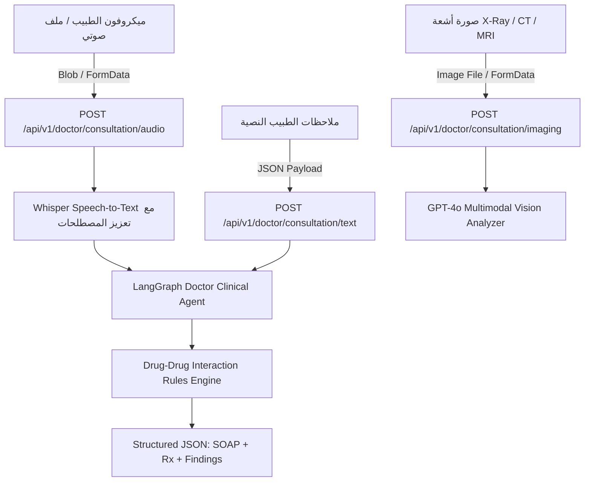

# 🩺 دليل التكامل البرمجي الشامل لمساعد الطبيب الذكي (Phase 2 Master Guide)
## نظام "عيادتي" الذكي — خدمات الذكاء الاصطناعي السريري والتشخيص الإشعاعي

> **نسخة الدليل:** v2.0.0 — Production Ready  
> **موجّه إلى:** مهندس الواجهات الأمامية (Frontend Engineer / Full-Stack Developer)  
> **الهدف:** توفير مرجع برمجي متكامل ومغلق بنسبة 100% يحتوي على جميع الـ Endpoints، مع الترويسات، نماذج الطلبات، جداول شرح كل حقل في الـ JSON، معالجة الأخطاء، ونماذج كود TypeScript & React كاملة جاهزة للنسخ واللصق.

---

## 📑 فهرس المحتويات
1. [معمارية النظام وسير البيانات السريرية (Architecture & Data Flow)](#1-معمارية-النظام-وسير-البيانات-السريرية)
2. [بيئة التشغيل والترويسات الأساسية (Environment & Headers)](#2-بيئة-التشغيل-والترويسات-الأساسية)
3. [مرجع الـ APIs بالتفصيل (Complete Phase 2 API Reference)](#3-مرجع-الـ-apis-بالتفصيل)
   - [3.1 تفريغ وتحليل الاستشارة الصوتية الطبية (Voice-to-SOAP)](#31-تفريغ-وتحليل-الاستشارة-الصوتية-الطبية-voice-to-soap)
   - [3.2 تحليل الملاحظات النصية المباشرة للطبيب (Text-to-SOAP)](#32-تحليل-الملاحظات-النصية-المباشرة-للطبيب-text-to-soap)
   - [3.3 فحص الأشعة والتحاليل بالرؤية الحاسوبية (Medical Imaging VLM Scanner)](#33-فحص-الأشعة-والتحاليل-بالرؤية-الحاسوبية-medical-imaging-vlm-scanner)
   - [3.4 صمام أمان فحص تعارض وتداخل الأدوية (Drug-Drug Interactions Guardrail)](#34-صمام-أمان-فحص-تعارض-وتداخل-الأدوية-drug-drug-interactions-guardrail)
   - [3.5 البحث في البروتوكولات العلاجية المبنية على الدليل (Evidence-Based Guidelines)](#35-البحث-في-البروتوكولات-العلاجية-المبنية-على-الدليل-evidence-based-guidelines)
4. [قاموس حقول الاستجابة السريرية (JSON Field Dictionary)](#4-قاموس-حقول-الاستجابة-السريرية)
5. [أكواد وأشكال أخطاء الخادم (Error Handling & HTTP Status Codes)](#5-أكواد-وأشكال-أخطاء-الخادم)
6. [ملفات Postman الجاهزة لـ Phase 2 (Postman Collection)](#6-ملفات-postman-الجاهزة-لـ-phase-2)
7. [نماذج كود TypeScript & React كاملة للنسخ واللصق](#7-نماذج-كود-typescript--react-كاملة-للنسخ-واللصق)
   - [7.1 تعريفات الـ Types (`types/doctor.ts`)](#71-تعريفات-الـ-types-typesdoctorts)
   - [7.2 كود استدعاء الـ APIs (`services/doctorApi.ts`)](#72-كود-استدعاء-الـ-apis-servicesdoctorapits)
   - [7.3 هوك تسجيل الصوت المباشر من الميكروفون (`hooks/useAudioRecorder.ts`)](#73-هوك-تسجيل-الصوت-المباشر-من-الميكروفون-hooksuseaudiorecorderts)
   - [7.4 صفحة مساعد الطبيب الكاملة مع التصميم (`DoctorCoPilot.tsx`)](#74-صفحة-مساعد-الطبيب-الكاملة-مع-التصميم-doctorcopilottsx)

---

## 1. معمارية النظام وسير البيانات السريرية



---

## 2. بيئة التشغيل والترويسات الأساسية

### 🌐 العناوين الأساسية (Base URLs):
* **الخادم السحابي الحي (Live Production API):**  
  `https://3eyadaty-api.up.railway.app`
* **الخادم المحلي (Local Development):**  
  `http://localhost:8000`
* **واجهة التوثيق التفاعلية (Swagger UI):**  
  `https://3eyadaty-api.up.railway.app/docs`

### 🔑 الترويسة الأمنية الإجبارية (Required Header):
يجب إرسال ترويسة التوكن في جميع طلبات مساعد الطبيب:
```http
X-Clinic-Token: clinic-secret-2026
```

---

## 3. مرجع الـ APIs بالتفصيل

---

### 3.1 تفريغ وتحليل الاستشارة الصوتية الطبية (Voice-to-SOAP)
المحرك الرئيسي لتسجيل المحادثة الصوتية بين الطبيب والمريض في غرفة الكشف. يقوم بنسخ الصوت طبياً عبر Whisper مع تعزيز المصطلحات الطبية، ثم استخراج وتوليد تقرير SOAP كامل، تشخيص تفريقي، روشتة ذكية، وفحص تعارض الأدوية فورياً.

* **المسار:** `POST /api/v1/doctor/consultation/audio`
* **نوع المحتوى:** `multipart/form-data`
* **الترويسات الإجبارية:** `X-Clinic-Token: clinic-secret-2026`

#### 📤 معاملات الـ FormData:
| المعامل | النوع | إجباري؟ | الوصف |
| :--- | :---: | :---: | :--- |
| `file` | `File / Blob` | **نعم** | ملف الصوت المسجل من المتصفح (الصيغ المدعومة: `webm`, `mp3`, `wav`, `m4a`) |
| `clinic_id` | `string` | لا | معرف العيادة (الافتراضي: `default-clinic`) |
| `patient_phone` | `string` | لا | رقم هاتف المريض لربط الجلسة بسجله الطبي |

#### 📥 استجابة النجاح النموذجية (Success Response 200 OK):
```json
{
  "success": true,
  "consultation_id": "9b1deb4d-3b7d-4bad-9bdd-2b0d7b3dcb6d",
  "transcription": {
    "transcript": "المريض: يا دكتور بقالي 4 أيام بشتكي من صداع مستمر في مؤخرة الرأس وزغللة في العين مع دوخة، ولما قست الضغط كان 160 على 100...",
    "duration_seconds": 48.5,
    "provider": "openai-whisper"
  },
  "primary_diagnosis": "Stage 2 Essential Hypertension (ارتفاع ضغط الدم الأولي من الدرجة الثانية)",
  "differential_diagnoses": [
    {
      "diagnosis": "Tension Headache",
      "probability": "20%",
      "rationale": "وجود الصداع القفوي المرتبط بالإجهاد"
    }
  ],
  "soap_notes": {
    "subjective": "المريض يشتكي من صداع قفوي مستمر منذ 4 أيام مصحوب بزغللة ودوخة ونغزات خفيفة بالصدر مع المجهود. يوجد تاريخ عائلي للضغط.",
    "objective": "ضغط الدم: 160/100 mmHg، النبض: 78 bpm. فحص الصدر والقلب سليم.",
    "assessment": "Stage 2 Essential Hypertension.",
    "plan": "بدء علاج Amlodipine 5mg صباحاً مع Concor 2.5mg، طلب رسم قلب ECG وتحليل وظائف كلى، تقليل الملح في الطعام، وإعادة المتابعة بعد أسبوعين."
  },
  "vital_signs": {
    "blood_pressure": "160/100",
    "heart_rate": "78 bpm"
  },
  "prescription": [
    {
      "name": "Amlodipine 5mg",
      "dosage": "5mg",
      "frequency": "مرة واحدة يومياً صباحاً",
      "duration": "شهر",
      "instructions": "يؤخذ بعد الإفطار مع قياس الضغط اليومي"
    },
    {
      "name": "Concor 2.5mg",
      "dosage": "2.5mg",
      "frequency": "مرة واحدة يومياً",
      "duration": "شهر",
      "instructions": "يؤخذ صباحاً"
    }
  ],
  "drug_interactions": {
    "safe_to_prescribe": true,
    "total_interactions_found": 0,
    "interactions": []
  },
  "lab_requests": [
    "تحليل وظائف كلى Serum Creatinine",
    "رسم قلب كهربائي 12-Lead ECG"
  ],
  "follow_up_recommendation": "إعادة الكشف وقياس الضغط بعد أسبوعين"
}
```

---

### 3.2 تحليل الملاحظات النصية المباشرة للطبيب (Text-to-SOAP)
يُستخدم في حال رغبة الطبيب في كتابة أو لصق ملاحظاته السريرية نصياً بدلاً من التسجيل الصوتي.

* **المسار:** `POST /api/v1/doctor/consultation/text`
* **نوع المحتوى:** `application/json`
* **الترويسات الإجبارية:** `X-Clinic-Token: clinic-secret-2026`

#### 📤 Request Body:
```json
{
  "clinical_notes": "المريض يشتكي من ارتفاع السكر التراكمي HbA1c 9.2% وعطش شديد وتبول متكرر. الوزن 92 كجم والضغط 130/80.",
  "clinic_id": "default-clinic",
  "patient_phone": "01284709314"
}
```

#### 📥 استجابة النجاح (Success Response 200 OK):
*(تُرجع نفس بنية استجابة الـ SOAP السابقة بالكامل)*.

---

### 3.3 فحص الأشعة والتحاليل بالرؤية الحاسوبية (Medical Imaging VLM Scanner)
تحليل الأشعة السينية (X-Ray)، الرنين المغناطيسي (MRI)، الأشعة المقطعية (CT)، وصور التحاليل المعملية عبر **GPT-4o Multimodal Vision**.

* **المسار:** `POST /api/v1/doctor/consultation/imaging`
* **نوع المحتوى:** `multipart/form-data`
* **الترويسات الإجبارية:** `X-Clinic-Token: clinic-secret-2026`

#### 📤 معاملات الـ FormData:
| المعامل | النوع | إجباري؟ | الوصف |
| :--- | :---: | :---: | :--- |
| `image_file` | `File` | **نعم** (أو `image_url`) | ملف صورة الفحص (JPEG / PNG / DICOM) |
| `image_url` | `string` | بديل لـ `image_file` | رابط مباشر للصورة في حال كانت مرفوعة سحابياً |
| `image_type` | `string` | **نعم** | نوع الفحص: `xray` أو `mri` أو `ct` أو `lab_report` |
| `clinical_context` | `string` | لا | شكوى المريض أو السياق السريري للفحص |
| `clinic_id` | `string` | لا | `default-clinic` |

#### 📥 استجابة النجاح النموذجية (Success Response 200 OK):
```json
{
  "success": true,
  "consultation_id": "e4f8b912-3a21-4fbc-a89c-982173491290",
  "modality": "CHEST X-RAY PA VIEW",
  "anatomical_region": "Thoracic Cavity / Lungs",
  "quality_assessment": "Adequate inspiration and optimal penetration",
  "findings": [
    {
      "structure": "Right Lower Lobe",
      "observation": "Patchy alveolar consolidation consistent with focal bacterial pneumonia.",
      "is_abnormal": true
    },
    {
      "structure": "Cardiac Silhouette",
      "observation": "Normal cardiothoracic ratio (< 0.5). No cardiomegaly.",
      "is_abnormal": false
    },
    {
      "structure": "Costophrenic Angles",
      "observation": "Sharp and clear bilaterally. No pleural effusion.",
      "is_abnormal": false
    }
  ],
  "abnormal_flags": [
    "Focal Consolidation - Right Lower Lobe"
  ],
  "impression": "Findings are suggestive of Right Lower Lobe Community-Acquired Bacterial Pneumonia.",
  "confidence_level": "High",
  "recommendations": [
    "Initiate targeted empirical antibacterial therapy as per clinical guidelines.",
    "Follow-up post-treatment radiograph in 4 to 6 weeks if symptoms persist."
  ],
  "critical_alert": null
}
```

---

### 3.4 صمام أمان فحص تعارض وتداخل الأدوية (Drug-Drug Interactions Guardrail)
فحص فوري لقائمة الأدوية الموصوفة للتأكد من خلوها من التداخلات الدوائية الخطيرة (مثل Warfarin مع Aspirin).

* **المسار:** `POST /api/v1/doctor/prescription/validate`
* **نوع المحتوى:** `application/json`
* **الترويسات الإجبارية:** `X-Clinic-Token: clinic-secret-2026`

#### 📤 Request Body:
```json
{
  "medications": ["Warfarin 5mg", "Aspirin 81mg", "Panadol 500mg"]
}
```

#### 📥 استجابة التحذير عند وجود تعارض خطير (Critical Warning 200 OK):
```json
{
  "success": true,
  "evaluated_medications": ["Warfarin 5mg", "Aspirin 81mg", "Panadol 500mg"],
  "safety_audit": {
    "safe_to_prescribe": false,
    "total_interactions_found": 1,
    "interactions": [
      {
        "drugs": ["warfarin", "aspirin"],
        "severity": "CRITICAL",
        "clinical_effect": "Severe risk of major gastrointestinal hemorrhage and bleeding.",
        "recommendation": "Avoid concurrent combination or closely monitor INR and prescribe a gastroprotective PPI."
      }
    ],
    "status": "WARNING_INTERACTION_DETECTED"
  }
}
```

---

### 3.5 البحث في البروتوكولات العلاجية المبنية على الدليل (Evidence-Based Guidelines)
استرجاع أدوية الخط الأول، تعديلات نمط الحياة، وعلامات الخطر الحرجة لأي تشخيص طبي.

* **المسار:** `GET /api/v1/doctor/guidelines/search?condition={name}`
* **الترويسات الإجبارية:** `X-Clinic-Token: clinic-secret-2026`
* **مثال:** `GET /api/v1/doctor/guidelines/search?condition=Hypertension`

#### 📥 استجابة النجاح:
```json
{
  "condition": "Hypertension (Adult Essential)",
  "first_line_therapy": [
    {
      "class": "ACE Inhibitors / ARBs",
      "examples": ["Lisinopril 10-40mg", "Losartan 50-100mg"]
    },
    {
      "class": "Calcium Channel Blockers (CCB)",
      "examples": ["Amlodipine 5-10mg"]
    },
    {
      "class": "Thiazide Diuretics",
      "examples": ["Hydrochlorothiazide 12.5-25mg", "Indapamide 1.5mg"]
    }
  ],
  "lifestyle_modifications": "Sodium restriction (< 2g/day), DASH diet, 30 min daily aerobic exercise, weight reduction.",
  "red_flags": "Blood pressure > 180/120 mmHg (Hypertensive Crisis), chest pain, neurological deficit, shortness of breath."
}
```

---

## 4. قاموس حقول الاستجابة السريرية (JSON Field Dictionary)

| الحقل في الاستجابة | النوع | المعنى السريري وكيفية عرضه في الفرونت إند |
| :--- | :---: | :--- |
| `primary_diagnosis` | `string` | **التشخيص الطبي الأولي والرئيسي** — اعرضه بخط عريض كعنوان بارز في أعلى تقرير الكشف. |
| `differential_diagnoses` | `Array` | **التشخيصات التفريقية المحتملة** — اعرضها كـ Badges تحتوي اسم المرض ونسبة الاحتمالية `probability`. |
| `soap_notes.subjective` | `string` | **شكوى المريض والأعراض (S)** — ما رواه المريض أثناء الجلسة وتاريخه العائلي. |
| `soap_notes.objective` | `string` | **نتائج الفحص والمؤشرات الحيوية (O)** — القياسات السريرية (الضغط، النبض، فحص الصدر). |
| `soap_notes.assessment` | `string` | **التقييم السريري للطبيب (A)** — التحليل الطبي لمطابقة الأعراض مع التشخيص. |
| `soap_notes.plan` | `string` | **الخطة العلاجية والتعليمات (P)** — الأدوية، التحاليل المطلوبة، وموعد الإعادة. |
| `prescription` | `Array` | **جدول الروشتة الذكية** — يحتوي `name`, `dosage`, `frequency`, `duration`, `instructions`. |
| `drug_interactions.safe_to_prescribe` | `boolean` | `true`: الروشتة آمنة (عرض كارت أخضر)، `false`: يوجد تعارض خطير (عرض كارت أحمر تحذيري بارز). |
| `findings` (في الأشعة) | `Array` | **الملاحظات التشريحية للأشعة** — تشمل العضو، الملاحظة، وعلامة `is_abnormal` لتلوين الشذوذ بالأحمر. |
| `impression` (في الأشعة) | `string` | **الانطباع النهائي لطبيب الأشعة** — الخلاصة التشخيصية للفحص الإشعاعي. |

---

## 5. أكواد وأشكال أخطاء الخادم (Error Handling & HTTP Status Codes)

| كود الخطأ (HTTP Status) | السبب المحتمل | شكل رد الخطأ (JSON Error Payload) |
| :---: | :--- | :--- |
| **`400 Bad Request`** | لم يتم إرفاق ملف صوتي أو صيغة غير مدعومة | `{"detail": "No audio file uploaded or invalid format"}` |
| **`401 Unauthorized`** | نسيان إرسال ترويسة `X-Clinic-Token` أو توكن غير صحيح | `{"detail": "Invalid or missing clinic secret token"}` |
| **`422 Unprocessable`** | حقل إجباري مفقود في الـ JSON Body | `{"detail": [{"loc": ["body", "clinical_notes"], "msg": "field required"}]}` |
| **`500 Internal Error`** | انقطاع خدمة الـ AI أو مزود الـ LLM | `{"detail": "Clinical reasoning node encountered an upstream service error"}` |

---

## 6. ملفات Postman الجاهزة لـ Phase 2

تم تجهيز كولكشن مستقلة مخصصة لـ Phase 2 في مجلد `postman/`:
* 📁 **ملف الكولكشن:** `postman/3eyadaty_Phase2_Doctor_AI.postman_collection.json`
* 📁 **ملف البيئة:** `postman/3eyadaty_Production.postman_environment.json`

### 🚀 خطوات الاستيراد:
1. في Postman اضغط **Import** واسحب ملف الكولكشن.
2. تأكد من تفعيل متغير البيئة `{{base_url}}` إلى `https://3eyadaty-api.up.railway.app`.
3. تفعيل متغير `{{clinic_token}}` إلى `clinic-secret-2026`.

---

## 7. نماذج كود TypeScript & React كاملة للنسخ واللصق

### 7.1 تعريفات الـ Types (`types/doctor.ts`)
```typescript
export interface SOAPNotes {
  subjective: string;
  objective: string;
  assessment: string;
  plan: string;
}

export interface PrescriptionItem {
  name: string;
  dosage: string;
  frequency: string;
  duration: string;
  instructions: string;
}

export interface DrugInteraction {
  drugs: string[];
  severity: "CRITICAL" | "MODERATE" | "MINOR";
  clinical_effect: string;
  recommendation: string;
}

export interface ConsultationResponse {
  success: boolean;
  consultation_id: string;
  transcription?: {
    transcript: string;
    duration_seconds: number;
    provider: string;
  };
  primary_diagnosis: string;
  differential_diagnoses: {
    diagnosis: string;
    probability: string;
    rationale: string;
  }[];
  soap_notes: SOAPNotes;
  vital_signs: Record<string, string>;
  prescription: PrescriptionItem[];
  drug_interactions: {
    safe_to_prescribe: boolean;
    total_interactions_found: number;
    interactions: DrugInteraction[];
  };
  lab_requests: string[];
  follow_up_recommendation: string;
}

export interface ImagingFinding {
  structure: string;
  observation: string;
  is_abnormal: boolean;
}

export interface ImagingResponse {
  success: boolean;
  consultation_id: string;
  modality: string;
  anatomical_region: string;
  quality_assessment: string;
  findings: ImagingFinding[];
  abnormal_flags: string[];
  impression: string;
  confidence_level: string;
  recommendations: string[];
  critical_alert?: string | null;
}
```

---

### 7.2 كود استدعاء الـ APIs (`services/doctorApi.ts`)
```typescript
const BASE_URL = "https://3eyadaty-api.up.railway.app";
const CLINIC_TOKEN = "clinic-secret-2026";
const DEFAULT_CLINIC = "default-clinic";

export const doctorApi = {
  // 1. إرسال تسجيل صوتي للكشف
  analyzeAudio: async (audioBlob: Blob, filename = "consultation.webm"): Promise<ConsultationResponse> => {
    const formData = new FormData();
    formData.append("file", audioBlob, filename);
    formData.append("clinic_id", DEFAULT_CLINIC);

    const res = await fetch(`${BASE_URL}/api/v1/doctor/consultation/audio`, {
      method: "POST",
      headers: { "X-Clinic-Token": CLINIC_TOKEN },
      body: formData,
    });
    if (!res.ok) throw new Error(`Audio consultation error: ${res.status}`);
    return res.json();
  },

  // 2. إرسال ملاحظات نصية مباشرة
  analyzeText: async (clinicalNotes: string): Promise<ConsultationResponse> => {
    const res = await fetch(`${BASE_URL}/api/v1/doctor/consultation/text`, {
      method: "POST",
      headers: {
        "Content-Type": "application/json",
        "X-Clinic-Token": CLINIC_TOKEN,
      },
      body: JSON.stringify({
        clinical_notes: clinicalNotes,
        clinic_id: DEFAULT_CLINIC,
      }),
    });
    if (!res.ok) throw new Error(`Text consultation error: ${res.status}`);
    return res.json();
  },

  // 3. فحص الأشعة والتحاليل VLM
  analyzeImaging: async (params: {
    imageFile?: File;
    imageUrl?: string;
    imageType: "xray" | "mri" | "ct" | "lab_report";
    clinicalContext?: string;
  }): Promise<ImagingResponse> => {
    const formData = new FormData();
    if (params.imageFile) formData.append("image_file", params.imageFile);
    if (params.imageUrl) formData.append("image_url", params.imageUrl);
    formData.append("image_type", params.imageType);
    formData.append("clinical_context", params.clinicalContext || "");
    formData.append("clinic_id", DEFAULT_CLINIC);

    const res = await fetch(`${BASE_URL}/api/v1/doctor/consultation/imaging`, {
      method: "POST",
      headers: { "X-Clinic-Token": CLINIC_TOKEN },
      body: formData,
    });
    if (!res.ok) throw new Error(`Imaging analysis error: ${res.status}`);
    return res.json();
  },

  // 4. فحص أمان الروشتة وتعارض الأدوية
  validatePrescription: async (medications: string[]) => {
    const res = await fetch(`${BASE_URL}/api/v1/doctor/prescription/validate`, {
      method: "POST",
      headers: {
        "Content-Type": "application/json",
        "X-Clinic-Token": CLINIC_TOKEN,
      },
      body: JSON.stringify({ medications }),
    });
    return res.json();
  },

  // 5. استرجاع البروتوكولات الطبية
  getGuidelines: async (condition: string) => {
    const res = await fetch(
      `${BASE_URL}/api/v1/doctor/guidelines/search?condition=${encodeURIComponent(condition)}`,
      {
        headers: { "X-Clinic-Token": CLINIC_TOKEN },
      }
    );
    return res.json();
  },
};
```

---

### 7.3 هوك تسجيل الصوت المباشر من الميكروفون (`hooks/useAudioRecorder.ts`)
```typescript
import { useState, useRef } from "react";

export function useAudioRecorder() {
  const [isRecording, setIsRecording] = useState(false);
  const [recordingDuration, setRecordingDuration] = useState(0);
  const [audioBlob, setAudioBlob] = useState<Blob | null>(null);
  const [audioUrl, setAudioUrl] = useState<string | null>(null);

  const mediaRecorderRef = useRef<MediaRecorder | null>(null);
  const chunksRef = useRef<Blob[]>([]);
  const timerRef = useRef<NodeJS.Timeout | null>(null);

  const startRecording = async () => {
    try {
      const stream = await navigator.mediaDevices.getUserMedia({ audio: true });
      mediaRecorderRef.current = new MediaRecorder(stream);
      chunksRef.current = [];

      mediaRecorderRef.current.ondataavailable = (e) => {
        if (e.data.size > 0) chunksRef.current.push(e.data);
      };

      mediaRecorderRef.current.onstop = () => {
        const blob = new Blob(chunksRef.current, { type: "audio/webm" });
        setAudioBlob(blob);
        setAudioUrl(URL.createObjectURL(blob));
        stream.getTracks().forEach((t) => t.stop());
      };

      mediaRecorderRef.current.start();
      setIsRecording(true);
      setRecordingDuration(0);

      timerRef.current = setInterval(() => {
        setRecordingDuration((prev) => prev + 1);
      }, 1000);
    } catch (err) {
      alert("يرجى إعطاء صلاحية الميكروفون للمتصفح لتسجيل الكشف الطبي.");
    }
  };

  const stopRecording = () => {
    if (mediaRecorderRef.current && isRecording) {
      mediaRecorderRef.current.stop();
      setIsRecording(false);
      if (timerRef.current) clearInterval(timerRef.current);
    }
  };

  return {
    isRecording,
    recordingDuration,
    audioBlob,
    audioUrl,
    startRecording,
    stopRecording,
  };
}
```
