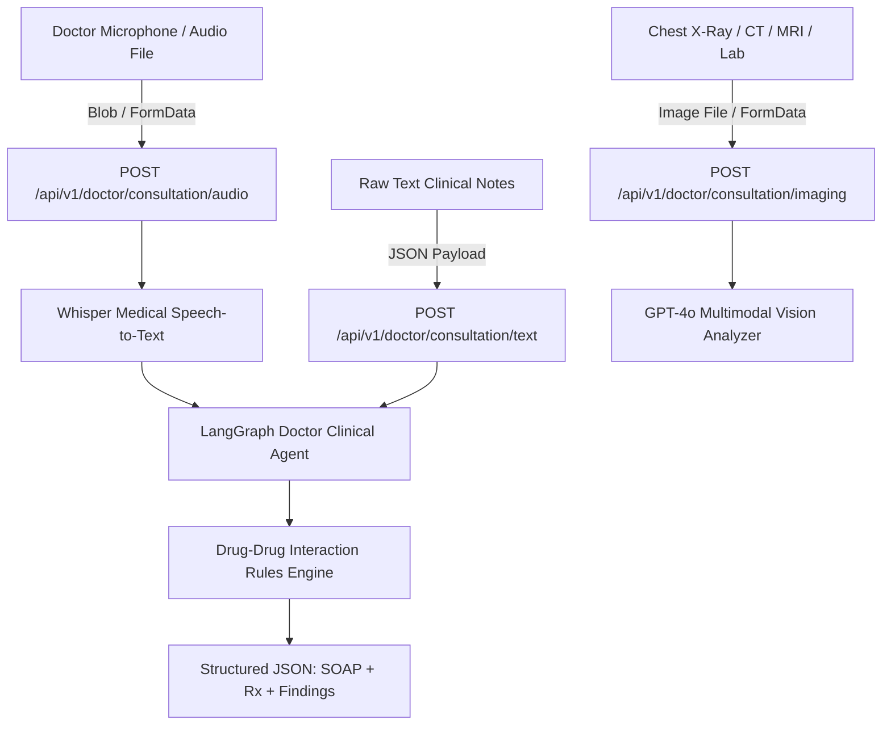

# 🩺 Doctor AI & Clinical Intelligence Integration Guide (Phase 2 Master Guide)
## 3eyadaty Smart Healthcare System — Clinical AI Co-Pilot & Multimodal VLM Scanner

> **Guide Version:** v2.0.0 — Production Ready  
> **Target Audience:** Frontend Engineer / Full-Stack Developer  
> **Objective:** A 100% self-contained, complete integration guide covering all endpoints, authentication headers, request payloads, JSON field dictionaries, error handling, and ready-to-use TypeScript & React code snippets.

---

## 📑 Table of Contents
1. [System Architecture & Clinical Data Flow](#1-system-architecture--clinical-data-flow)
2. [Environment & Authentication Headers](#2-environment--authentication-headers)
3. [Complete Phase 2 API Reference](#3-complete-phase-2-api-reference)
   - [3.1 Voice-to-SOAP Audio Consultation (`/api/v1/doctor/consultation/audio`)](#31-voice-to-soap-audio-consultation-apiv1doctorconsultationaudio)
   - [3.2 Direct Text-to-SOAP Clinical Notes (`/api/v1/doctor/consultation/text`)](#32-direct-text-to-soap-clinical-notes-apiv1doctorconsultationtext)
   - [3.3 Multimodal Vision Medical Imaging & Lab Scanner (`/api/v1/doctor/consultation/imaging`)](#33-multimodal-vision-medical-imaging--lab-scanner-apiv1doctorconsultationimaging)
   - [3.4 Drug-Drug Interaction Safety Guardrail (`/api/v1/doctor/prescription/validate`)](#34-drug-drug-interaction-safety-guardrail-apiv1doctorprescriptionvalidate)
   - [3.5 Evidence-Based Clinical Guidelines Search (`/api/v1/doctor/guidelines/search`)](#35-evidence-based-clinical-guidelines-search-apiv1doctorguidelinessearch)
4. [Clinical JSON Response Field Dictionary](#4-clinical-json-response-field-dictionary)
5. [Error Handling & HTTP Status Codes](#5-error-handling--http-status-codes)
6. [Standalone Postman Collection](#6-standalone-postman-collection)
7. [Ready-to-Use TypeScript & React Snippets](#7-ready-to-use-typescript--react-snippets)
   - [7.1 TypeScript Interfaces (`types/doctor.ts`)](#71-typescript-interfaces-typesdoctorts)
   - [7.2 API Service Client (`services/doctorApi.ts`)](#72-api-service-client-servicesdoctorapits)
   - [7.3 Browser Audio Recording Hook (`hooks/useAudioRecorder.ts`)](#73-browser-audio-recording-hook-hooksuseaudiorecorderts)

---

## 1. System Architecture & Clinical Data Flow



---

## 2. Environment & Authentication Headers

### 🌐 Base URLs:
* **Live Production Server (Railway Cloud):**  
  `https://3eyadaty-api.up.railway.app`
* **Local Development Server:**  
  `http://localhost:8000`
* **Interactive Swagger UI:**  
  `https://3eyadaty-api.up.railway.app/docs`

### 🔑 Mandatory Security Header:
All doctor endpoints require the clinic authentication token:
```http
X-Clinic-Token: clinic-secret-2026
```

---

## 3. Complete Phase 2 API Reference

---

### 3.1 Voice-to-SOAP Audio Consultation (`/api/v1/doctor/consultation/audio`)
Uploads a doctor-patient audio consultation file recorded from the browser microphone. Transcribes via Whisper with medical terminology priming, then generates structured clinical SOAP notes, differential diagnoses, smart prescriptions, and real-time drug interaction safety checks.

* **HTTP Method:** `POST`
* **Content-Type:** `multipart/form-data`
* **Required Header:** `X-Clinic-Token: clinic-secret-2026`

#### 📤 FormData Parameters:
| Parameter | Type | Required? | Description |
| :--- | :---: | :---: | :--- |
| `file` | `File / Blob` | **Yes** | Audio recording file (supported: `webm`, `mp3`, `wav`, `m4a`) |
| `clinic_id` | `string` | No | Clinic ID (Default: `default-clinic`) |
| `patient_phone` | `string` | No | Patient phone number to link with patient medical history |

#### 📥 Success Response (200 OK):
```json
{
  "success": true,
  "consultation_id": "9b1deb4d-3b7d-4bad-9bdd-2b0d7b3dcb6d",
  "transcription": {
    "transcript": "Patient presents with persistent occipital headache for 4 days, blurred vision, dizziness, and home BP 160/100 mmHg...",
    "duration_seconds": 48.5,
    "provider": "openai-whisper"
  },
  "primary_diagnosis": "Stage 2 Essential Hypertension",
  "differential_diagnoses": [
    {
      "diagnosis": "Tension Headache",
      "probability": "20%",
      "rationale": "Occipital headache associated with physical fatigue"
    }
  ],
  "soap_notes": {
    "subjective": "Patient complains of persistent occipital headaches for 4 days associated with dizziness, blurred vision, and mild exertional chest discomfort. Positive family history of hypertension.",
    "objective": "Blood Pressure: 160/100 mmHg, Heart Rate: 78 bpm. Chest and cardiovascular examination are unremarkable.",
    "assessment": "Stage 2 Essential Hypertension.",
    "plan": "Initiate Amlodipine 5mg OD AM and Concor 2.5mg OD. Order 12-lead ECG and renal function tests. Advise strict low-sodium DASH diet. Follow-up in 2 weeks."
  },
  "vital_signs": {
    "blood_pressure": "160/100",
    "heart_rate": "78 bpm"
  },
  "prescription": [
    {
      "name": "Amlodipine 5mg",
      "dosage": "5mg",
      "frequency": "Once daily in the morning",
      "duration": "1 month",
      "instructions": "Take after breakfast with daily BP monitoring"
    },
    {
      "name": "Concor 2.5mg",
      "dosage": "2.5mg",
      "frequency": "Once daily",
      "duration": "1 month",
      "instructions": "Take in the morning"
    }
  ],
  "drug_interactions": {
    "safe_to_prescribe": true,
    "total_interactions_found": 0,
    "interactions": []
  },
  "lab_requests": [
    "Serum Creatinine & Electrolytes",
    "12-Lead Electrocardiogram (ECG)"
  ],
  "follow_up_recommendation": "Review blood pressure and repeat assessment in 2 weeks"
}
```

---

### 3.2 Direct Text-to-SOAP Clinical Notes (`/api/v1/doctor/consultation/text`)
For doctors who prefer typing or pasting raw clinical notes directly instead of audio recording.

* **HTTP Method:** `POST`
* **Content-Type:** `application/json`
* **Required Header:** `X-Clinic-Token: clinic-secret-2026`

#### 📤 Request Body:
```json
{
  "clinical_notes": "Patient with uncontrolled Type 2 Diabetes, HbA1c 9.2%, polydipsia, and polyuria. Weight 92kg, BP 130/80. Plan: Metformin 1000mg BID + Empagliflozin 10mg OD.",
  "clinic_id": "default-clinic",
  "patient_phone": "01284709314"
}
```

#### 📥 Response (200 OK):
*(Returns the same rich structured consultation schema as above)*.

---

### 3.3 Multimodal Vision Medical Imaging & Lab Scanner (`/api/v1/doctor/consultation/imaging`)
Analyzes Chest X-Rays, Brain/Spine MRIs, CT Scans, and laboratory reports using **GPT-4o Multimodal Vision** to generate structured anatomical observations and diagnostic impressions.

* **HTTP Method:** `POST`
* **Content-Type:** `multipart/form-data`
* **Required Header:** `X-Clinic-Token: clinic-secret-2026`

#### 📤 FormData Parameters:
| Parameter | Type | Required? | Description |
| :--- | :---: | :---: | :--- |
| `image_file` | `File` | **Yes** (or `image_url`) | Image file (JPEG, PNG, DICOM) |
| `image_url` | `string` | Alternative | Direct accessible URL if hosted in cloud |
| `image_type` | `string` | **Yes** | Modality: `xray` \| `mri` \| `ct` \| `lab_report` |
| `clinical_context` | `string` | No | Patient symptoms or clinical suspicion |
| `clinic_id` | `string` | No | `default-clinic` |

#### 📥 Success Response (200 OK):
```json
{
  "success": true,
  "consultation_id": "e4f8b912-3a21-4fbc-a89c-982173491290",
  "modality": "CHEST X-RAY PA VIEW",
  "anatomical_region": "Thoracic Cavity / Lungs",
  "quality_assessment": "Adequate inspiration and optimal penetration",
  "findings": [
    {
      "structure": "Right Lower Lobe",
      "observation": "Patchy alveolar consolidation consistent with focal bacterial pneumonia.",
      "is_abnormal": true
    },
    {
      "structure": "Cardiac Silhouette",
      "observation": "Normal cardiothoracic ratio (< 0.5). No cardiomegaly.",
      "is_abnormal": false
    },
    {
      "structure": "Costophrenic Angles",
      "observation": "Sharp and clear bilaterally. No pleural effusion.",
      "is_abnormal": false
    }
  ],
  "abnormal_flags": [
    "Focal Consolidation - Right Lower Lobe"
  ],
  "impression": "Findings are suggestive of Right Lower Lobe Community-Acquired Bacterial Pneumonia.",
  "confidence_level": "High",
  "recommendations": [
    "Initiate targeted empirical antibacterial therapy as per clinical guidelines.",
    "Follow-up post-treatment radiograph in 4 to 6 weeks if symptoms persist."
  ],
  "critical_alert": null
}
```

---

### 3.4 Drug-Drug Interaction Safety Guardrail (`/api/v1/doctor/prescription/validate`)
Real-time safety interceptor auditing a list of prescribed medications to detect hazardous interactions (e.g. Warfarin + Aspirin).

* **HTTP Method:** `POST`
* **Content-Type:** `application/json`
* **Required Header:** `X-Clinic-Token: clinic-secret-2026`

#### 📤 Request Body:
```json
{
  "medications": ["Warfarin 5mg", "Aspirin 81mg", "Panadol 500mg"]
}
```

#### 📥 Warning Response (Hazardous Interaction Detected):
```json
{
  "success": true,
  "evaluated_medications": ["Warfarin 5mg", "Aspirin 81mg", "Panadol 500mg"],
  "safety_audit": {
    "safe_to_prescribe": false,
    "total_interactions_found": 1,
    "interactions": [
      {
        "drugs": ["warfarin", "aspirin"],
        "severity": "CRITICAL",
        "clinical_effect": "Severe risk of major gastrointestinal hemorrhage and bleeding.",
        "recommendation": "Avoid concurrent combination or closely monitor INR and prescribe a gastroprotective PPI."
      }
    ],
    "status": "WARNING_INTERACTION_DETECTED"
  }
}
```

---

### 3.5 Evidence-Based Clinical Guidelines Search (`/api/v1/doctor/guidelines/search`)
Query evidence-based first-line therapies, lifestyle modifications, and red-flag alerts for medical conditions.

* **HTTP Method:** `GET`
* **Required Header:** `X-Clinic-Token: clinic-secret-2026`
* **Endpoint:** `/api/v1/doctor/guidelines/search?condition=Hypertension`

#### 📥 Success Response:
```json
{
  "condition": "Hypertension (Adult Essential)",
  "first_line_therapy": [
    {
      "class": "ACE Inhibitors / ARBs",
      "examples": ["Lisinopril 10-40mg", "Losartan 50-100mg"]
    },
    {
      "class": "Calcium Channel Blockers (CCB)",
      "examples": ["Amlodipine 5-10mg"]
    },
    {
      "class": "Thiazide Diuretics",
      "examples": ["Hydrochlorothiazide 12.5-25mg", "Indapamide 1.5mg"]
    }
  ],
  "lifestyle_modifications": "Sodium restriction (< 2g/day), DASH diet, 30 min daily aerobic exercise, weight reduction.",
  "red_flags": "Blood pressure > 180/120 mmHg (Hypertensive Crisis), chest pain, neurological deficit, shortness of breath."
}
```

---

## 4. Clinical JSON Response Field Dictionary

| Response Field | Type | Clinical Meaning & UI Recommendation |
| :--- | :---: | :--- |
| `primary_diagnosis` | `string` | **Primary Medical Diagnosis** — Render prominently as a bold banner header at the top of the consultation view. |
| `differential_diagnoses` | `Array` | **Differential Diagnoses** — Render as badges showing condition name and `probability` percentage. |
| `soap_notes.subjective` | `string` | **Subjective (S)** — Patient symptoms, chief complaints, and family history. |
| `soap_notes.objective` | `string` | **Objective (O)** — Clinical examination findings, vital signs (BP, HR, RR). |
| `soap_notes.assessment` | `string` | **Assessment (A)** — Clinical reasoning matching symptoms to diagnosis. |
| `soap_notes.plan` | `string` | **Plan (P)** — Pharmacological therapy, lab investigations, and follow-up timeline. |
| `prescription` | `Array` | **Smart Rx Table** — Contains `name`, `dosage`, `frequency`, `duration`, and `instructions`. |
| `drug_interactions.safe_to_prescribe` | `boolean` | `true`: Safe Rx (green banner), `false`: Hazardous interaction detected (red critical warning card). |
| `findings` (Imaging) | `Array` | **Anatomical Observations** — Contains structure name, observation text, and `is_abnormal` flag. |
| `impression` (Imaging) | `string` | **Radiological Impression** — Diagnostic conclusion of the visual scan. |

---

## 5. Error Handling & HTTP Status Codes

| HTTP Status | Trigger Condition | JSON Error Payload |
| :---: | :--- | :--- |
| **`400 Bad Request`** | No audio file attached or invalid file format | `{"detail": "No audio file uploaded or invalid format"}` |
| **`401 Unauthorized`** | Missing or incorrect `X-Clinic-Token` header | `{"detail": "Invalid or missing clinic secret token"}` |
| **`422 Unprocessable`** | Missing required field in JSON body | `{"detail": [{"loc": ["body", "clinical_notes"], "msg": "field required"}]}` |
| **`500 Internal Error`** | Upstream AI service error or LLM failure | `{"detail": "Clinical reasoning node encountered an upstream service error"}` |

---

## 6. Standalone Postman Collection

A standalone collection dedicated exclusively to Phase 2 is available at:
* 📁 **Collection File:** `postman/3eyadaty_Phase2_Doctor_AI.postman_collection.json`
* 📁 **Environment File:** `postman/3eyadaty_Production.postman_environment.json`

### 🚀 How to Import:
1. In Postman, click **Import** and drag `3eyadaty_Phase2_Doctor_AI.postman_collection.json`.
2. Select the environment: `🏥 3eyadaty - Production (Railway Cloud)`.
3. All 5 requests are pre-configured and ready to execute.

---

## 7. Ready-to-Use TypeScript & React Snippets

### 7.1 TypeScript Interfaces (`types/doctor.ts`)
```typescript
export interface SOAPNotes {
  subjective: string;
  objective: string;
  assessment: string;
  plan: string;
}

export interface PrescriptionItem {
  name: string;
  dosage: string;
  frequency: string;
  duration: string;
  instructions: string;
}

export interface DrugInteraction {
  drugs: string[];
  severity: "CRITICAL" | "MODERATE" | "MINOR";
  clinical_effect: string;
  recommendation: string;
}

export interface ConsultationResponse {
  success: boolean;
  consultation_id: string;
  transcription?: {
    transcript: string;
    duration_seconds: number;
    provider: string;
  };
  primary_diagnosis: string;
  differential_diagnoses: {
    diagnosis: string;
    probability: string;
    rationale: string;
  }[];
  soap_notes: SOAPNotes;
  vital_signs: Record<string, string>;
  prescription: PrescriptionItem[];
  drug_interactions: {
    safe_to_prescribe: boolean;
    total_interactions_found: number;
    interactions: DrugInteraction[];
  };
  lab_requests: string[];
  follow_up_recommendation: string;
}

export interface ImagingFinding {
  structure: string;
  observation: string;
  is_abnormal: boolean;
}

export interface ImagingResponse {
  success: boolean;
  consultation_id: string;
  modality: string;
  anatomical_region: string;
  quality_assessment: string;
  findings: ImagingFinding[];
  abnormal_flags: string[];
  impression: string;
  confidence_level: string;
  recommendations: string[];
  critical_alert?: string | null;
}
```

---

### 7.2 API Service Client (`services/doctorApi.ts`)
```typescript
const BASE_URL = "https://3eyadaty-api.up.railway.app";
const CLINIC_TOKEN = "clinic-secret-2026";
const DEFAULT_CLINIC = "default-clinic";

export const doctorApi = {
  // 1. Audio Consultation Upload
  analyzeAudio: async (audioBlob: Blob, filename = "consultation.webm"): Promise<ConsultationResponse> => {
    const formData = new FormData();
    formData.append("file", audioBlob, filename);
    formData.append("clinic_id", DEFAULT_CLINIC);

    const res = await fetch(`${BASE_URL}/api/v1/doctor/consultation/audio`, {
      method: "POST",
      headers: { "X-Clinic-Token": CLINIC_TOKEN },
      body: formData,
    });
    if (!res.ok) throw new Error(`Audio consultation error: ${res.status}`);
    return res.json();
  },

  // 2. Text Clinical Notes
  analyzeText: async (clinicalNotes: string): Promise<ConsultationResponse> => {
    const res = await fetch(`${BASE_URL}/api/v1/doctor/consultation/text`, {
      method: "POST",
      headers: {
        "Content-Type": "application/json",
        "X-Clinic-Token": CLINIC_TOKEN,
      },
      body: JSON.stringify({
        clinical_notes: clinicalNotes,
        clinic_id: DEFAULT_CLINIC,
      }),
    });
    if (!res.ok) throw new Error(`Text consultation error: ${res.status}`);
    return res.json();
  },

  // 3. Multimodal VLM Medical Image Analysis
  analyzeImaging: async (params: {
    imageFile?: File;
    imageUrl?: string;
    imageType: "xray" | "mri" | "ct" | "lab_report";
    clinicalContext?: string;
  }): Promise<ImagingResponse> => {
    const formData = new FormData();
    if (params.imageFile) formData.append("image_file", params.imageFile);
    if (params.imageUrl) formData.append("image_url", params.imageUrl);
    formData.append("image_type", params.imageType);
    formData.append("clinical_context", params.clinicalContext || "");
    formData.append("clinic_id", DEFAULT_CLINIC);

    const res = await fetch(`${BASE_URL}/api/v1/doctor/consultation/imaging`, {
      method: "POST",
      headers: { "X-Clinic-Token": CLINIC_TOKEN },
      body: formData,
    });
    if (!res.ok) throw new Error(`Imaging analysis error: ${res.status}`);
    return res.json();
  },

  // 4. Drug-Drug Interactions Check
  validatePrescription: async (medications: string[]) => {
    const res = await fetch(`${BASE_URL}/api/v1/doctor/prescription/validate`, {
      method: "POST",
      headers: {
        "Content-Type": "application/json",
        "X-Clinic-Token": CLINIC_TOKEN,
      },
      body: JSON.stringify({ medications }),
    });
    return res.json();
  },

  // 5. Evidence-Based Clinical Guidelines
  getGuidelines: async (condition: string) => {
    const res = await fetch(
      `${BASE_URL}/api/v1/doctor/guidelines/search?condition=${encodeURIComponent(condition)}`,
      {
        headers: { "X-Clinic-Token": CLINIC_TOKEN },
      }
    );
    return res.json();
  },
};
```

---

### 7.3 Browser Audio Recording Hook (`hooks/useAudioRecorder.ts`)
```typescript
import { useState, useRef } from "react";

export function useAudioRecorder() {
  const [isRecording, setIsRecording] = useState(false);
  const [recordingDuration, setRecordingDuration] = useState(0);
  const [audioBlob, setAudioBlob] = useState<Blob | null>(null);
  const [audioUrl, setAudioUrl] = useState<string | null>(null);

  const mediaRecorderRef = useRef<MediaRecorder | null>(null);
  const chunksRef = useRef<Blob[]>([]);
  const timerRef = useRef<NodeJS.Timeout | null>(null);

  const startRecording = async () => {
    try {
      const stream = await navigator.mediaDevices.getUserMedia({ audio: true });
      mediaRecorderRef.current = new MediaRecorder(stream);
      chunksRef.current = [];

      mediaRecorderRef.current.ondataavailable = (e) => {
        if (e.data.size > 0) chunksRef.current.push(e.data);
      };

      mediaRecorderRef.current.onstop = () => {
        const blob = new Blob(chunksRef.current, { type: "audio/webm" });
        setAudioBlob(blob);
        setAudioUrl(URL.createObjectURL(blob));
        stream.getTracks().forEach((t) => t.stop());
      };

      mediaRecorderRef.current.start();
      setIsRecording(true);
      setRecordingDuration(0);

      timerRef.current = setInterval(() => {
        setRecordingDuration((prev) => prev + 1);
      }, 1000);
    } catch (err) {
      alert("Please allow microphone permissions to record audio consultations.");
    }
  };

  const stopRecording = () => {
    if (mediaRecorderRef.current && isRecording) {
      mediaRecorderRef.current.stop();
      setIsRecording(false);
      if (timerRef.current) clearInterval(timerRef.current);
    }
  };

  return {
    isRecording,
    recordingDuration,
    audioBlob,
    audioUrl,
    startRecording,
    stopRecording,
  };
}
```
