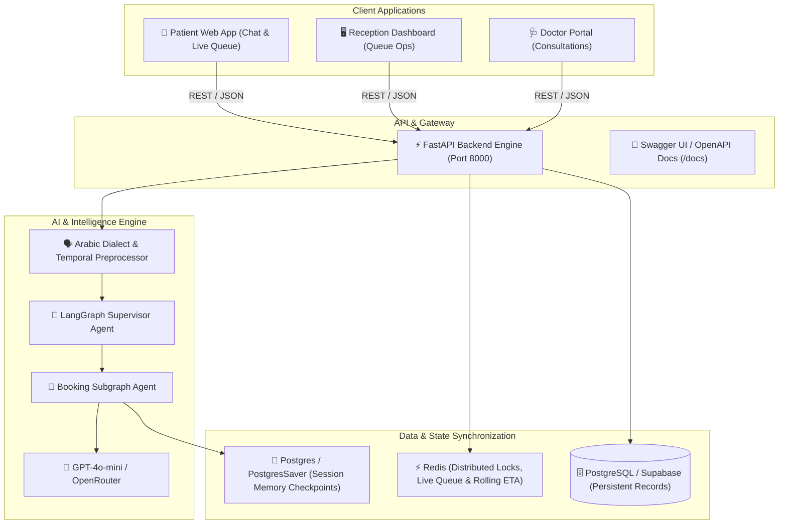

<div align="center">

# 🏥 3eyadaty (عيادتي)
### Enterprise Autonomous AI Clinic Management & Real-Time Queue System

[](https://fastapi.tiangolo.com)
[](https://langchain-ai.github.io/langgraph/)
[](https://python.org)
[](https://redis.io)
[](https://nextjs.org)
[-brightgreen?style=for-the-badge&logo=pytest&logoColor=white)](backend/run_all_tests.py)
[](LICENSE)

<p align="center">
  <b>Production-grade, resilient clinic management platform featuring autonomous multi-turn LangGraph AI booking agents, Egyptian Arabic dialect NLP, millisecond-level distributed slot locking, and dynamic live queue tracking with rolling average ETA recalculation.</b>
</p>

[Frontend Guide (العربية)](FRONTEND_INTEGRATION_GUIDE.md) • [Frontend Guide (English)](FRONTEND_INTEGRATION_GUIDE_EN.md) • [Interactive API Docs](http://localhost:8000/docs)

</div>

---

## 🌟 Key Capabilities & Architectural Highlights

- 🤖 **Autonomous Multi-Turn AI Booking Agent**: Powered by LangGraph supervisor and booking subgraphs with persistent memory (`thread_id`), handling availability inquiries, bookings, rescheduling, and cancellations in natural Egyptian Arabic dialect.
- 🔒 **Distributed Concurrency & Race Condition Defense**: Redis-backed atomic distributed locking guarantees single-winner slot allocation even under heavy simultaneous load (verified under 10+ concurrent coroutines).
- 🗣️ **Egyptian Dialect NLP Engine**: Normalizes spelled-out phone numbers (*"زيرو عشره اتناشر..."* ➔ `01012...`), relative Arabic times (*"حداشر ونص الصبح"*, *"واحدة الضهر"*, *"اربعه العصر"*), and Arabic-Indic numerals.
- ⏱️ **Dynamic Live Queue & Rolling Average ETA**: Real-time queue tracker with automatic rolling-average recalculation upon each completed consultation, providing patients with accurate waiting times.
- 🛡️ **Enterprise Security Guardrails**:
  - **Single Active Booking per Day**: Prevents appointment spamming and slot denial-of-service.
  - **ID Hijacking & Unauthorized Modification Defense**: Restricts cancellations and queries exclusively to verified session owners.
  - **Temporal Integrity Engine**: Automatically rejects past dates and expired hours of today, handles weekly clinic off-days (Friday), and dynamically suggests the next available working day.
- 🧪 **Comprehensive Automated Test Suite**: 39 automated enterprise tests across 4 suites with a **100.0% pass rate**.

---

## 🏛️ System Architecture



---

## 🚀 Quick Start (Local Development)

### 1. Prerequisites
- **Python 3.12+**
- **Node.js 20+**
- **Docker & Docker Compose** (Optional, for full stack containerization)
- **Redis Server** (Local or Upstash)

### 2. Clone and Setup Environment
```bash
git clone https://github.com/Gohar-Hany/Clinics-system.git
cd Clinics-system

# Copy environment template
cp .env.example .env
# Edit .env and configure your OPENROUTER_API_KEY and REDIS_URL
```

### 3. Run Backend (FastAPI + LangGraph)
```bash
cd backend
python -m venv venv

# Windows
.\venv\Scripts\activate

# Linux / macOS
source venv/bin/activate

pip install -r requirements.txt
uvicorn app.main:app --host 0.0.0.0 --port 8000 --reload
```
API will be live at `http://localhost:8000`.  
Explore the interactive Swagger UI at **`http://localhost:8000/docs`**.

### 4. Run Automated Test Suites
Execute all 39 enterprise tests across all 4 suites:
```bash
python backend/run_all_tests.py
```

### 5. Run Frontend (Next.js 15)
```bash
cd frontend
npm install
npm run dev
```
Frontend runs at `http://localhost:3000`.

---

## 📡 API Reference Overview

| Endpoint | Method | Purpose | Key Parameters / Payload |
| :--- | :---: | :--- | :--- |
| `/api/v1/chat` | `POST` | AI Booking & Inquiries | `message`, `clinic_id`, `thread_id`, `patient_phone` |
| `/api/v1/queue/position/{clinic}/{doc}/{appt}` | `GET` | Patient Live Queue Tracker | `queue_number`, `current_serving`, `estimated_wait_minutes` |
| `/api/v1/queue/state/{clinic}/{doc}` | `GET` | Reception Live Queue Dashboard | `entries`, `current_serving`, `avg_consultation_minutes` |
| `/api/v1/queue/check-in/{appt}` | `POST` | Patient Arrival Check-In | `clinic_id`, `doctor_id` |
| `/api/v1/queue/start/{appt}` | `POST` | Start Consultation Room | `queue_number`, `clinic_id`, `doctor_id` |
| `/api/v1/queue/complete/{appt}` | `POST` | Finish Consultation & Update ETA | `duration_minutes`, `clinic_id`, `doctor_id` |
| `/api/v1/queue/cancel/{appt}` | `POST` | Skip No-Show Patient | `clinic_id`, `doctor_id` |
| `/api/v1/appointments/{clinic}` | `GET` | List Clinic Appointments | `date`, `doctor_id` |
| `/health` | `GET` | Healthcheck & Cloud Monitoring | System status & version |

For full request/response schemas, TypeScript types, and React hooks, see:
- 📖 **[Frontend Integration Guide (Arabic)](FRONTEND_INTEGRATION_GUIDE.md)**
- 📖 **[Frontend Integration Guide (English)](FRONTEND_INTEGRATION_GUIDE_EN.md)**

---

## 🧪 Enterprise Test Audit Report

```text
======================================================================
🏥 CLINIC MANAGEMENT SYSTEM — MASTER ENTERPRISE TEST SUITE RUNNER
======================================================================
  1. Exact User Scenario & Phone Memory Suite        : ✅ PASSED (14.96s)
  2. Concurrency & Slot Isolation Suite              : ✅ PASSED (15.42s)
  3. Enterprise 18-Test Comprehensive Suite          : ✅ PASSED (23.48s)
  4. Production Resilience & Security Suite          : ✅ PASSED (12.46s)
----------------------------------------------------------------------
Total Suites Executed : 4
Passed Suites         : 4
Failed Suites         : 0 (39 / 39 Tests Passing)
Total Execution Time  : 66.31s
System Health Status  : 100% PRODUCTION READY 🚀
======================================================================
```

---

## ☁️ Deployment Guide (Railway & Cloud)

### 🚂 Deploying Backend on Railway:
This repository includes a production-ready `Dockerfile` and `railway.json`.

1. Connect your GitHub repository to [Railway](https://railway.com).
2. Set the **Root Directory** to `backend` (or deploy from root using the configured `railway.json`).
3. Add the following **Environment Variables** in Railway:
   - `OPENROUTER_API_KEY`: Your OpenRouter API key
   - `REDIS_URL`: Upstash or Railway Redis connection URL
   - `SYNC_DATABASE_URL`: PostgreSQL connection string (Supabase / Railway Postgres)
   - `PORT`: (Automatically assigned by Railway)
4. Deploy! The healthcheck at `/health` will verify successful startup.

---

## 📂 Project Structure

```
Clinics-system/
├── FRONTEND_INTEGRATION_GUIDE.md    # Complete Developer Handoff (Arabic)
├── FRONTEND_INTEGRATION_GUIDE_EN.md # Complete Developer Handoff (English)
├── README.md                        # Master Documentation
├── railway.json                     # Railway Cloud Deployment Config
├── docker-compose.yml               # Local Full-Stack Container Orchestration
├── backend/
│   ├── Dockerfile                   # Production Python 3.12 Container
│   ├── Procfile                     # Process File for Cloud Deployments
│   ├── requirements.txt             # Python Dependencies
│   ├── run_all_tests.py             # Master Test Runner (39 Tests)
│   ├── app/
│   │   ├── main.py                  # FastAPI Entrypoint & Lifecycle
│   │   ├── config.py                # Pydantic Settings & Env Config
│   │   ├── core/                    # Arabic NLP, Checkpointer, Security
│   │   ├── agents/                  # LangGraph Supervisor & Booking Subgraphs
│   │   ├── api/v1/                  # REST Endpoints (Chat, Queue, Appointments)
│   │   └── services/                # Business Logic & Redis Distributed Engine
│   └── tests/                       # Enterprise & Production Test Suites
└── frontend/                        # Next.js 15 App Router Frontend
```

---

## 📄 License
This project is licensed under the MIT License — see the [LICENSE](LICENSE) file for details.
