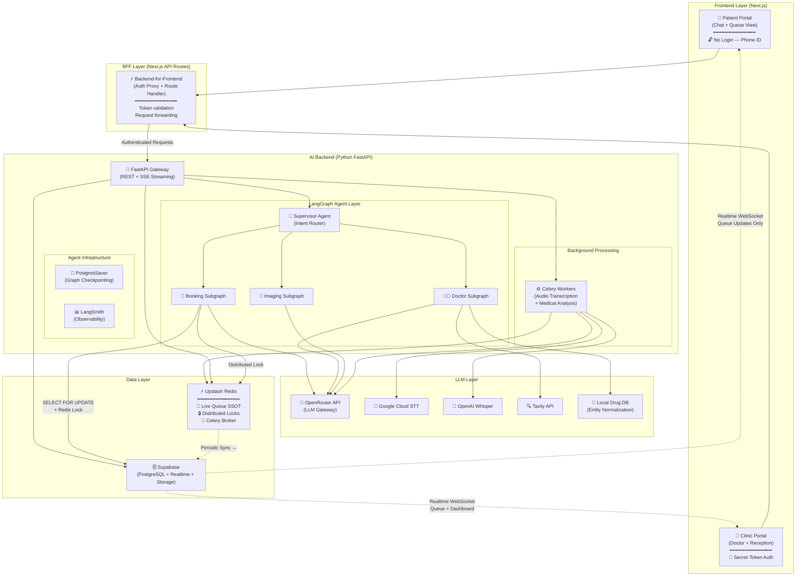
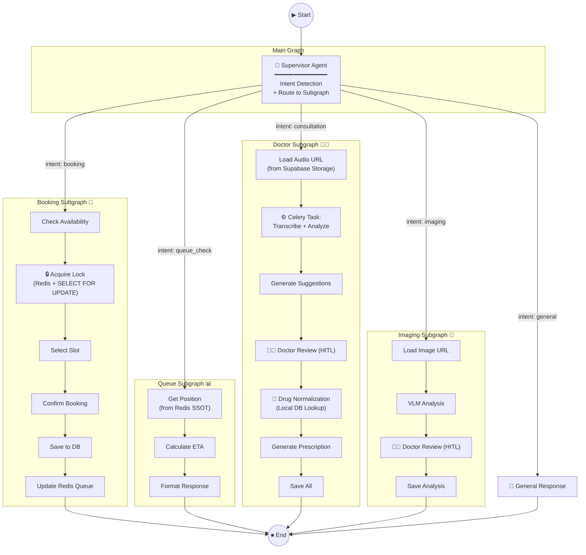
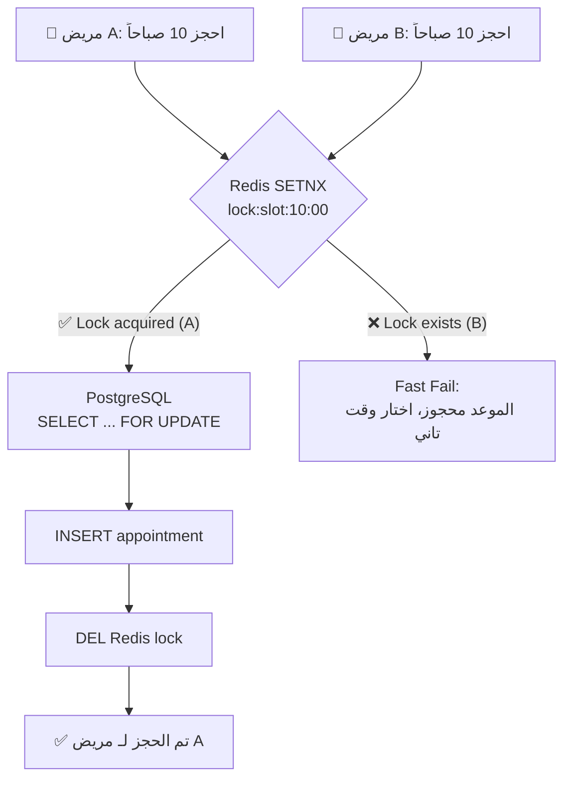
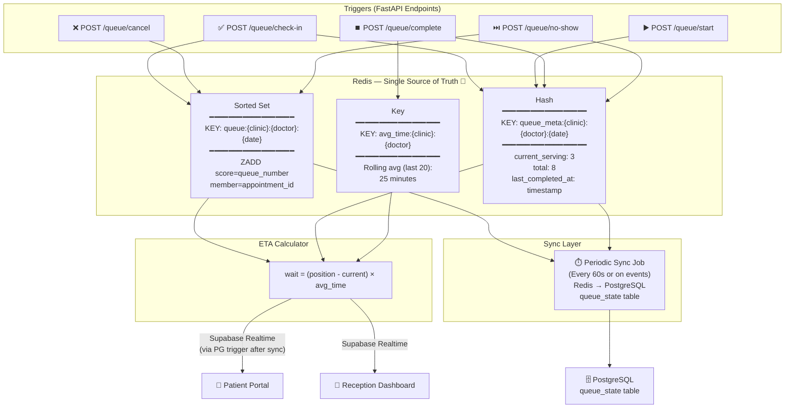
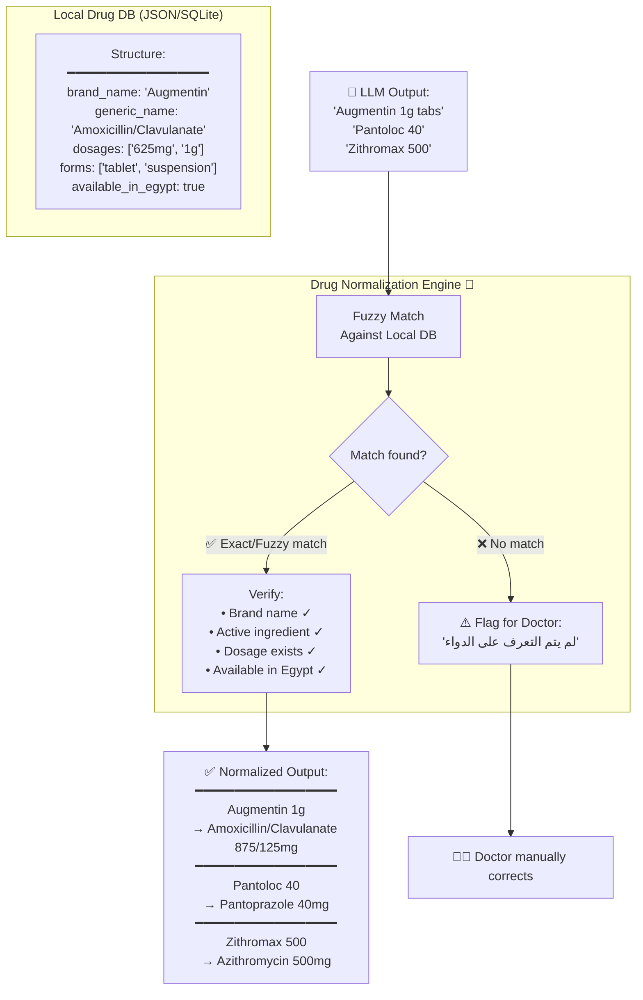
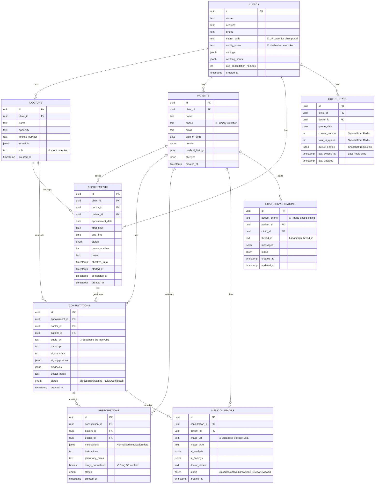

# 🏥 AI-Powered Clinic Management System — Architecture & Implementation Plan (v3)

## Overview

نظام إدارة عيادات ذكي مبني على AI Agents بمعمارية Enterprise-grade، يبدأ بعيادة واحدة ومجهّز للتوسع لـ Multi-tenant SaaS.

| Phase | الوصف | الأولوية |
|-------|-------|----------|
| **Phase 1** | حجز المواعيد + إدارة الطابور بالذكاء الاصطناعي | 🔴 عالية |
| **Phase 2** | مساعد الدكتور الذكي (تحليل الكشف + الروشتة الإلكترونية) | 🟡 متوسطة |
| **Phase 3** | تحليل الأشعة بالـ VLM | 🟢 مستقبلية |

### Two Web Portals (كل حاجة ويب)

| Portal | المستخدم | الوصول | الوظائف |
|--------|---------|--------|---------|
| **Patient Portal** | المريض | 🔓 مفتوح — بيتعرف عليه برقم التليفون | حجز مواعيد عبر Chat + متابعة الطابور + عرض الروشتات |
| **Clinic Portal** | الدكتور + الريسبشن | 🔐 محمي — Secret Path + Config Token | Dashboard + إدارة الطابور + الكشف + الأشعة |

---

## 🏗️ System Architecture (Enterprise-Grade)



### Key Architectural Decisions (v3)

| القرار | التفاصيل |
|--------|----------|
| **Record-then-Analyze** | لا يوجد WebSocket streaming للصوت. الدكتور يسجل → يرفع الملف → Celery يعالج → SSE notification |
| **WebSocket فقط للطابور** | Supabase Realtime يُستخدم حصرياً لتحديثات حالة الطابور وشاشات الداشبورد |
| **Redis = Live Queue SSOT** | Redis هو مصدر الحقيقة الوحيد للطابور اللحظي. PostgreSQL يتزامن دورياً للـ durability |
| **Distributed Locking** | `SELECT ... FOR UPDATE` + Redis Lock لمنع حجز نفس الموعد مرتين |
| **No State Bloat** | لا يوجد binary data في LangGraph State — فقط URLs وروابط |
| **Drug Normalization** | كل اسم دواء يُطابَق مع Local Drug DB قبل الروشتة لمنع هلوسة الـ LLM |
| **Passwordless MVP** | المريض: رقم التليفون. العيادة: Secret Path + Config Token |
| **Celery from Day 1** | البنية التحتية للمعالجة الخلفية جاهزة من المرحلة الأولى |

---

## 📦 Tech Stack (v3)

### Core Stack

| Layer | Technology | السبب |
|-------|-----------|-------|
| **Frontend** | Next.js 15 (App Router) + TypeScript | SSR + BFF layer + Server Components |
| **Styling** | Vanilla CSS + CSS Variables | مرونة كاملة + Design System مخصص |
| **State Management** | Zustand + React Query (TanStack Query) | خفيف + Server State ممتاز |
| **Real-time** | Supabase Realtime | حصرياً لتحديثات الطابور والداشبورد |
| **AI Backend** | Python 3.12 + FastAPI | Async + أفضل AI ecosystem |
| **Agent Framework** | LangGraph (StateGraph) | Stateful agents + Checkpointing + HITL |
| **Database** | Supabase (PostgreSQL) | Realtime + Storage + RLS |
| **Live Queue SSOT** | Upstash Redis | مصدر الحقيقة الوحيد للطابور اللحظي |
| **Distributed Locks** | Redis (SETNX) + PostgreSQL (FOR UPDATE) | منع تضارب الحجوزات المتزامنة |
| **Task Queue** | Celery + Redis (Broker) | Audio processing + Medical analysis |
| **Checkpointing** | PostgresSaver (langgraph-checkpoint-postgres) | Agent state persistence (بدون binary) |
| **Observability** | LangSmith | Graph-level tracing |
| **Drug Database** | Local JSON/SQLite → future API | Entity Normalization للأدوية |
| **File Storage** | Supabase Storage | ملفات الصوت + صور الأشعة |
| **Hosting (Frontend)** | Vercel | Zero-config Next.js |
| **Hosting (Backend)** | Railway | Docker containers |
| **Local Dev** | Docker Compose | FastAPI + Redis + Celery + Postgres |

### AI Stack

| Component | Technology | السبب |
|-----------|-----------|-------|
| **LLM Gateway** | OpenRouter API | موديلات متعددة بـ API واحد |
| **Booking Agent LLM** | `google/gemini-3.6-flash` via OpenRouter | سريع + رخيص + كافي للحجز |
| **Doctor Assistant LLM** | `openai/gpt-5` أو `anthropic/claude-4-sonnet` | أدق في التحليل الطبي |
| **VLM (Imaging)** | `google/gemini-3.1-pro` (Multimodal) | أقوى VLM متاح |
| **STT Option A** | Google Cloud Speech-to-Text (Arabic Medical) | اللهجة المصرية + مصطلحات طبية |
| **STT Option B** | OpenAI Whisper API | للمقارنة والبنشمارك |
| **Search Tool** | Tavily API | AI-optimized medical search |
| **Drug Normalization** | Local Drug DB (JSON/SQLite) | مطابقة أسماء الأدوية ومنع الهلوسة |

---

## 🔐 Authentication Strategy (MVP — Passwordless)

```mermaid
graph TB
    subgraph "Patient Portal 🔓"
        P_ENTER["المريض يدخل الموقع"] --> P_CHAT["يبدأ محادثة"]
        P_CHAT --> P_PHONE["الـ Agent يسأل عن رقم التليفون"]
        P_PHONE --> P_LOOKUP["بحث في DB بالرقم"]
        P_LOOKUP -->|"مريض موجود"| P_LOAD["تحميل بروفايل المريض"]
        P_LOOKUP -->|"مريض جديد"| P_CREATE["إنشاء سجل جديد"]
        P_LOAD --> P_CONTEXT["ربط السجل بسياق المحادثة<br/>(thread_id + patient_id)"]
        P_CREATE --> P_CONTEXT
    end

    subgraph "Clinic Portal 🔐"
        C_URL["الدكتور/الريسبشن يفتح<br/>/clinic/{secret_path}"] --> C_TOKEN["إدخال Config Token"]
        C_TOKEN --> C_VALIDATE["التحقق من التوكن"]
        C_VALIDATE -->|"✅ صحيح"| C_DASH["الداشبورد الكامل"]
        C_VALIDATE -->|"❌ خطأ"| C_REJECT["رفض الدخول"]
        C_DASH --> C_ROLE["تحديد الدور<br/>(Doctor / Reception)"]
    end
```



| Portal | طريقة التعرف | التخزين | الملاحظات |
|--------|-------------|---------|-----------|
| **Patient** | رقم التليفون (يُطلب في أول محادثة) | `localStorage` + Server session | لا يوجد تسجيل دخول تقليدي |
| **Clinic** | Secret URL path + Config Token | `httpOnly cookie` بعد التحقق | يُحدد في إعدادات العيادة |

---

## 🧠 LangGraph Agent Architecture (v3)

### Supervisor Pattern — Multi-Agent System



### State Schemas (v3 — No Bloat)

```python
from typing import TypedDict, Literal, Annotated
from langgraph.graph.message import add_messages

# ╔══════════════════════════════════════════════╗
# ║           Root State (Shared)                ║
# ╚══════════════════════════════════════════════╝
class ClinicAgentState(TypedDict):
    """Root state shared across all subgraphs"""
    messages: Annotated[list, add_messages]
    clinic_id: str
    patient_id: str | None          # Linked via phone number
    patient_phone: str | None       # Phone-based identification
    intent: Literal[
        "booking", "queue_check", "reschedule",
        "cancel", "consultation", "imaging", "general"
    ] | None
    current_agent: str
    error: str | None


# ╔══════════════════════════════════════════════╗
# ║         Booking Subgraph State               ║
# ╚══════════════════════════════════════════════╝
class BookingState(ClinicAgentState):
    doctor_id: str | None
    requested_date: str | None
    requested_time: str | None
    available_slots: list[dict] | None
    selected_slot: dict | None
    appointment_id: str | None
    queue_number: int | None
    lock_acquired: bool             # ← Distributed lock status
    booking_status: Literal[
        "checking_availability", "locking_slot",
        "slot_selected", "confirming",
        "confirmed", "failed", "slot_taken"
    ]


# ╔══════════════════════════════════════════════╗
# ║       Doctor Assistant Subgraph State        ║
# ║       ⚠️ NO binary data — URLs only          ║
# ╚══════════════════════════════════════════════╝
class DoctorAssistantState(ClinicAgentState):
    appointment_id: str
    audio_storage_url: str          # ← URL only (NOT bytes)
    transcript: str | None          # Filled by Celery worker
    symptoms_extracted: list[str] | None
    patient_history: dict | None
    ai_analysis: dict | None
    search_results: list[dict] | None
    treatment_suggestions: list[dict] | None
    doctor_decision: dict | None    # Doctor's choice (HITL)
    normalized_medications: list[dict] | None  # ← After Drug DB lookup
    prescription: dict | None
    consultation_status: Literal[
        "audio_uploaded", "transcribing",
        "analyzing", "searching", "suggesting",
        "awaiting_review", "normalizing_drugs",
        "prescribing", "completed"
    ]


# ╔══════════════════════════════════════════════╗
# ║         Imaging Subgraph State               ║
# ╚══════════════════════════════════════════════╝
class ImagingState(ClinicAgentState):
    consultation_id: str
    image_url: str                  # ← Supabase Storage URL
    image_type: str                 # xray, mri, ct, ultrasound
    clinical_context: str | None
    vlm_analysis: dict | None
    findings: list[dict] | None
    doctor_review: str | None       # Doctor's final review (HITL)
    analysis_status: Literal[
        "uploaded", "analyzing",
        "awaiting_review", "reviewed", "saved"
    ]
```

---

## ⚙️ Phase 1: Booking Agent + Queue Management (v3)

### Booking Flow — With Distributed Locking

```mermaid
sequenceDiagram
    participant P as 🧑 المريض (Patient Portal)
    participant BFF as ⚡ Next.js BFF
    participant API as 🚀 FastAPI
    participant LG as 🧠 LangGraph
    participant BOOK as 📅 Booking Subgraph
    participant OR as 🤖 OpenRouter
    participant REDIS as ⚡ Redis
    participant DB as 🗄️ Supabase (PostgreSQL)

    P->>BFF: "أنا محمد، رقمي 01012345678"
    BFF->>API: POST /api/v1/chat
    API->>LG: invoke(state)

    Note over LG: Supervisor: تعرف على المريض بالرقم

    LG->>DB: SELECT patient WHERE phone = '01012345678'
    DB-->>LG: patient_id (أو إنشاء سجل جديد)

    Note over LG: State: patient_id linked ✅

    P->>BFF: "عايز أحجز يوم الخميس"
    BFF->>API: POST /api/v1/chat
    API->>LG: invoke(state, config={thread_id})

    Note over LG: Supervisor → Booking Subgraph

    LG->>BOOK: Enter subgraph
    BOOK->>DB: SELECT available slots (Thursday)
    DB-->>BOOK: [10:00, 11:00, 14:00]
    BOOK-->>API: "متاح: 10 صباحاً، 11 صباحاً، 2 ظهراً"
    API-->>BFF: SSE stream
    BFF-->>P: عرض المواعيد

    Note over BOOK: Checkpoint saved ✅

    P->>BFF: "الساعة 10"
    BFF->>API: POST /api/v1/chat
    API->>LG: invoke(state, config={thread_id})

    Note over BOOK: ⚠️ Concurrent Booking Protection

    BOOK->>REDIS: SETNX lock:slot:thu:10:00 (TTL=30s)
    REDIS-->>BOOK: Lock acquired ✅

    BOOK->>DB: BEGIN; SELECT ... FOR UPDATE
    Note over DB: Row-level lock on the slot
    BOOK->>DB: INSERT appointment
    BOOK->>DB: COMMIT;
    BOOK->>REDIS: DEL lock:slot:thu:10:00

    Note over BOOK: Double protection:<br/>1. Redis SETNX (fast fail)<br/>2. SELECT FOR UPDATE (ACID guarantee)

    BOOK->>REDIS: ZADD queue:clinic:doctor:date<br/>(score=3, member=appointment_id)
    BOOK->>REDIS: HSET queue_meta (total=+1)

    Note over BOOK: State: booking_status = "confirmed"

    BOOK-->>API: "تم الحجز ✅ يوم الخميس 10 صباحاً. رقمك: 3"
    API-->>BFF: SSE stream
    BFF-->>P: عرض التأكيد

    Note over REDIS: Periodic sync → PostgreSQL
    REDIS--)DB: Sync queue_state table
```

### Concurrent Booking — Lock Flow (Detail)



### Agent Tools (Phase 1 — v3)

```python
@tool
def check_availability(doctor_id: str, date: str, time_range: str | None = None) -> dict:
    """Check available appointment slots for a doctor on a specific date.
    Returns: Dict with available_slots list and doctor info
    """
    ...

@tool
def create_appointment(
    patient_id: str, doctor_id: str,
    date: str, time: str, notes: str | None = None
) -> dict:
    """Book a new appointment with distributed locking.
    
    Flow:
    1. Redis SETNX for fast-fail duplicate prevention
    2. PostgreSQL SELECT ... FOR UPDATE for ACID guarantee
    3. INSERT appointment record
    4. ZADD to Redis queue sorted set
    5. Release lock
    
    Returns: Dict with appointment_id, queue_number, or slot_taken error
    """
    ...

@tool
def cancel_appointment(appointment_id: str, reason: str | None = None) -> dict:
    """Cancel an existing appointment and update Redis queue."""
    ...

@tool
def reschedule_appointment(
    appointment_id: str, new_date: str, new_time: str
) -> dict:
    """Reschedule appointment (cancel old + book new with locking)."""
    ...

@tool
def get_queue_position(patient_phone: str, doctor_id: str, date: str) -> dict:
    """Get patient's current position from Redis SSOT.
    
    Reads directly from Redis sorted set (not PostgreSQL).
    Returns: queue_position, current_serving, estimated_wait_minutes
    """
    ...
```

### Queue Management — Redis as SSOT (v3)



**Sync Strategy:**
| الحدث | مصدر الحقيقة | الـ Sync |
|-------|-------------|---------|
| **قراءة مكان في الطابور** | Redis (مباشر) | لا حاجة |
| **حساب ETA** | Redis (مباشر) | لا حاجة |
| **حجز جديد** | Redis → ثم sync لـ PG | فوري (Event-driven) |
| **بدء/إنهاء كشف** | Redis → ثم sync لـ PG | فوري (Event-driven) |
| **تاريخ الطابور** | PostgreSQL (للتقارير) | Periodic (كل 60 ثانية) |

---

## 🩺 Phase 2: Doctor Assistant Agent (v3 — Record-then-Analyze)

### Audio Processing Flow — No WebSocket Streaming

```mermaid
sequenceDiagram
    participant D as 👨‍⚕️ الدكتور (Clinic Portal)
    participant BROWSER as 🌐 Browser (MediaRecorder)
    participant BFF as ⚡ Next.js BFF
    participant API as 🚀 FastAPI
    participant STORE as 📁 Supabase Storage
    participant CEL as ⚙️ Celery Worker
    participant STT as 🎤 STT (Google / Whisper)
    participant LG as 🧠 Doctor Subgraph
    participant OR as 🤖 OpenRouter (GPT-5)
    participant TAV as 🔍 Tavily Search
    participant DRUG as 💊 Local Drug DB
    participant DB as 🗄️ Supabase (PostgreSQL)

    D->>BROWSER: 🔴 بدء تسجيل الكشف
    Note over BROWSER: Client-side MediaRecorder API<br/>تسجيل محلي على المتصفح<br/>━━━━━━━━━━━━━━━━━━━━<br/>لا يوجد streaming للسيرفر

    D->>BROWSER: ⏹️ إنهاء الكشف

    Note over BROWSER: ملف صوتي جاهز (WebM/MP3)

    BROWSER->>BFF: POST /api/consultation/upload<br/>(multipart/form-data)
    BFF->>STORE: Upload audio file
    STORE-->>BFF: audio_url
    BFF->>API: POST /api/v1/consultation/analyze<br/>{audio_url, appointment_id}

    Note over API: إطلاق مهمة خلفية

    API->>DB: Create consultation record<br/>(status: "processing")
    API->>CEL: consultation_analysis.delay(audio_url, ...)
    API-->>BFF: 202 Accepted {task_id}
    BFF-->>D: "جاري تحليل الكشف... ⏳"

    Note over CEL: ═══ Celery Worker ═══

    rect rgb(40, 40, 60)
        CEL->>STT: Transcribe audio file
        STT-->>CEL: transcript text

        CEL->>LG: invoke(DoctorAssistantState)

        Note over LG: State: "analyzing"
        LG->>OR: Analyze transcript + extract symptoms
        OR-->>LG: Symptoms + SOAP Note

        Note over LG: State: "searching"
        LG->>TAV: Search medical literature
        TAV-->>LG: Research papers + protocols

        Note over LG: State: "suggesting"
        LG->>OR: Generate treatment suggestions
        OR-->>LG: 3 treatment options + citations

        Note over LG: State: "awaiting_review"<br/>🛑 INTERRUPT (HITL)

        LG->>DB: Save suggestions to consultation
    end

    CEL->>DB: UPDATE consultation (status: "awaiting_review")

    Note over DB: Supabase Realtime trigger 📡

    DB--)BFF: Realtime notification
    BFF--)D: "التحليل جاهز! 🔔"

    D->>BFF: عرض التحليل + الاقتراحات
    D->>BFF: اختيار العلاج / تعديل
    BFF->>API: POST /api/v1/consultation/review<br/>{decision, selected_medications}

    API->>LG: Resume from checkpoint (HITL)

    Note over LG: State: "normalizing_drugs"

    LG->>DRUG: Normalize medication names
    DRUG-->>LG: Verified medications + active ingredients

    Note over LG: State: "prescribing"

    LG->>OR: Generate prescription
    OR-->>LG: Prescription data
    LG->>DB: Save prescription + consultation

    Note over LG: State: "completed" ✅

    LG-->>API: Final result
    API-->>BFF: Prescription ready
    BFF-->>D: عرض الروشتة الإلكترونية ✅
```



### Drug Entity Normalization Flow



### Doctor Agent Tools (v3)

```python
@tool
def get_patient_history(patient_id: str) -> dict:
    """Retrieve complete patient medical history.
    Returns: previous consultations, prescriptions, allergies, conditions
    """
    ...

@tool
def search_medical_literature(query: str, specialty: str | None = None) -> list[dict]:
    """Search medical literature using Tavily API.
    Returns: relevant sources with citations
    """
    ...

@tool
def check_drug_interactions(
    medications: list[str],
    patient_allergies: list[str] | None = None
) -> dict:
    """Check drug-drug interactions and allergy conflicts.
    Returns: interactions found and severity levels
    """
    ...

@tool
def normalize_medications(medications: list[dict]) -> list[dict]:
    """Normalize medication names against local drug database.
    
    Flow:
    1. Fuzzy match brand/generic name against local DB
    2. Verify dosage exists for the medication
    3. Check availability in Egypt
    4. Return normalized names + active ingredients
    5. Flag unrecognized medications
    
    Returns: List of normalized medications or flagged items
    """
    ...

@tool
def generate_prescription(
    medications: list[dict], instructions: str,
    doctor_id: str, patient_id: str, consultation_id: str
) -> dict:
    """Generate electronic prescription (after normalization).
    Returns: prescription_id and formatted prescription data
    """
    ...
```

---

## 🔬 Phase 3: Medical Imaging VLM Agent (v3)

```mermaid
sequenceDiagram
    participant D as 👨‍⚕️ الدكتور
    participant BFF as ⚡ Next.js BFF
    participant STORE as 📁 Supabase Storage
    participant API as 🚀 FastAPI
    participant CEL as ⚙️ Celery Worker
    participant LG as 🔬 Imaging Subgraph
    participant OR as 🤖 OpenRouter (Gemini Pro VLM)
    participant DB as 🗄️ Supabase

    D->>BFF: رفع صورة الأشعة
    BFF->>STORE: Upload image
    STORE-->>BFF: image_url
    BFF->>API: POST /api/v1/imaging/analyze

    API->>CEL: imaging_analysis.delay(image_url, ...)
    API-->>BFF: 202 Accepted
    BFF-->>D: "جاري تحليل الأشعة... ⏳"

    rect rgb(40, 40, 60)
        CEL->>LG: invoke(ImagingState)
        LG->>OR: Send image_url + clinical context
        Note over OR: VLM Analysis:<br/>1. Image type ID<br/>2. Abnormality detection<br/>3. Structured findings<br/>4. Confidence scores
        OR-->>LG: Analysis result
        Note over LG: 🛑 INTERRUPT (HITL)
        LG->>DB: Save analysis
    end

    CEL->>DB: UPDATE (status: "awaiting_review")
    DB--)BFF: Realtime notification 📡
    BFF--)D: "التحليل جاهز! 🔔"

    Note over D: ⚠️ هذا تحليل مساعد<br/>القرار النهائي للدكتور

    D->>BFF: مراجعة + تعديل + حفظ
    BFF->>API: POST /api/v1/imaging/review
    API->>LG: Resume (HITL)
    LG->>DB: Save doctor review ✅
```



---

## 📐 Database Schema (v3)



---

## 📁 Project Structure (v3)

```
d:\Clinics system\
│
├── frontend/                             # Next.js App (BFF + UI)
│   ├── src/
│   │   ├── app/
│   │   │   ├── layout.tsx
│   │   │   ├── page.tsx                  # Landing → redirect
│   │   │   │
│   │   │   ├── (patient)/                # 🔓 Patient Portal (No Auth)
│   │   │   │   ├── layout.tsx
│   │   │   │   ├── chat/page.tsx         # Booking chat
│   │   │   │   ├── queue/page.tsx        # Queue status
│   │   │   │   ├── appointments/page.tsx
│   │   │   │   └── prescriptions/page.tsx
│   │   │   │
│   │   │   ├── clinic/                   # 🔐 Clinic Portal (Token Auth)
│   │   │   │   ├── [secret_path]/        # Dynamic secret path
│   │   │   │   │   ├── layout.tsx        # Token validation middleware
│   │   │   │   │   ├── page.tsx          # Token entry form
│   │   │   │   │   ├── reception/
│   │   │   │   │   │   ├── page.tsx      # Queue management
│   │   │   │   │   │   └── components/
│   │   │   │   │   │       ├── QueueBoard.tsx
│   │   │   │   │   │       ├── PatientCard.tsx
│   │   │   │   │   │       ├── AppointmentList.tsx
│   │   │   │   │   │       └── DayStats.tsx
│   │   │   │   │   ├── doctor/
│   │   │   │   │   │   ├── page.tsx      # Doctor dashboard
│   │   │   │   │   │   ├── consultation/
│   │   │   │   │   │   │   └── [id]/page.tsx
│   │   │   │   │   │   └── components/
│   │   │   │   │   │       ├── ConsultationPanel.tsx
│   │   │   │   │   │       ├── AudioRecorder.tsx     # MediaRecorder
│   │   │   │   │   │       ├── AISuggestions.tsx
│   │   │   │   │   │       ├── PrescriptionBuilder.tsx
│   │   │   │   │   │       └── ImagingAnalysis.tsx
│   │   │   │   │   ├── patients/
│   │   │   │   │   │   ├── page.tsx
│   │   │   │   │   │   └── [id]/page.tsx
│   │   │   │   │   └── settings/
│   │   │   │   │       └── page.tsx
│   │   │   │
│   │   │   └── api/                      # BFF API Routes
│   │   │       ├── chat/route.ts
│   │   │       ├── consultation/
│   │   │       │   ├── upload/route.ts   # Audio upload → Storage
│   │   │       │   └── route.ts
│   │   │       ├── imaging/route.ts
│   │   │       └── auth/
│   │   │           └── clinic/route.ts   # Token validation
│   │   │
│   │   ├── lib/
│   │   │   ├── supabase/
│   │   │   │   ├── client.ts
│   │   │   │   └── server.ts
│   │   │   ├── api-client.ts             # FastAPI HTTP client
│   │   │   └── utils/
│   │   │
│   │   ├── components/
│   │   │   ├── ui/
│   │   │   ├── chat/
│   │   │   │   ├── ChatWidget.tsx
│   │   │   │   ├── ChatBubble.tsx
│   │   │   │   └── ChatInput.tsx
│   │   │   ├── queue/
│   │   │   │   ├── QueueStatus.tsx       # Patient queue view
│   │   │   │   └── QueuePosition.tsx
│   │   │   └── layout/
│   │   │       ├── Sidebar.tsx
│   │   │       └── Header.tsx
│   │   │
│   │   ├── hooks/
│   │   │   ├── useQueue.ts              # Supabase Realtime
│   │   │   ├── useChat.ts
│   │   │   ├── useAudioRecorder.ts      # MediaRecorder hook
│   │   │   └── useConsultation.ts
│   │   │
│   │   ├── stores/
│   │   │   ├── queue-store.ts
│   │   │   └── ui-store.ts
│   │   │
│   │   └── styles/
│   │       └── globals.css
│   │
│   ├── next.config.ts
│   ├── tsconfig.json
│   └── package.json
│
├── backend/                              # Python FastAPI (AI Backend)
│   ├── app/
│   │   ├── main.py                       # FastAPI entry
│   │   ├── config.py                     # Pydantic BaseSettings
│   │   │
│   │   ├── api/
│   │   │   ├── __init__.py
│   │   │   ├── v1/
│   │   │   │   ├── __init__.py
│   │   │   │   ├── router.py
│   │   │   │   ├── chat.py              # Booking chat
│   │   │   │   ├── consultation.py      # Upload + analyze + review
│   │   │   │   ├── imaging.py           # Upload + analyze + review
│   │   │   │   ├── queue.py             # Queue operations (Redis SSOT)
│   │   │   │   └── appointments.py
│   │   │   └── deps.py                  # Auth (token validation)
│   │   │
│   │   ├── agents/
│   │   │   ├── __init__.py
│   │   │   ├── supervisor.py
│   │   │   ├── booking/
│   │   │   │   ├── __init__.py
│   │   │   │   ├── graph.py             # Booking StateGraph
│   │   │   │   ├── nodes.py
│   │   │   │   ├── state.py
│   │   │   │   └── tools.py             # With distributed locking
│   │   │   ├── doctor/
│   │   │   │   ├── __init__.py
│   │   │   │   ├── graph.py             # Doctor StateGraph
│   │   │   │   ├── nodes.py
│   │   │   │   ├── state.py             # audio_storage_url (no bytes)
│   │   │   │   └── tools.py
│   │   │   └── imaging/
│   │   │       ├── __init__.py
│   │   │       ├── graph.py
│   │   │       ├── nodes.py
│   │   │       ├── state.py
│   │   │       └── tools.py
│   │   │
│   │   ├── services/
│   │   │   ├── __init__.py
│   │   │   ├── openrouter.py
│   │   │   ├── stt.py                   # Google STT + Whisper (benchmark)
│   │   │   ├── tavily_search.py
│   │   │   ├── drug_normalizer.py       # 💊 Drug entity normalization
│   │   │   ├── supabase.py
│   │   │   ├── redis_client.py
│   │   │   ├── queue_engine.py          # Redis SSOT + PG sync
│   │   │   └── locking.py              # 🔒 Distributed lock service
│   │   │
│   │   ├── data/
│   │   │   └── drugs_egypt.json         # 💊 Local drug database
│   │   │
│   │   ├── models/
│   │   │   ├── __init__.py
│   │   │   ├── schemas.py
│   │   │   └── enums.py
│   │   │
│   │   ├── core/
│   │   │   ├── __init__.py
│   │   │   ├── security.py              # Token validation
│   │   │   ├── checkpointer.py          # PostgresSaver (no binary)
│   │   │   └── exceptions.py
│   │   │
│   │   └── workers/
│   │       ├── __init__.py
│   │       ├── celery_app.py            # Celery config (Redis broker)
│   │       └── tasks.py                 # Audio transcription + analysis
│   │
│   ├── tests/
│   │   ├── test_booking_agent.py
│   │   ├── test_concurrent_booking.py   # Race condition tests
│   │   ├── test_drug_normalizer.py
│   │   ├── test_queue_engine.py
│   │   └── test_api.py
│   │
│   ├── Dockerfile
│   ├── requirements.txt
│   └── pyproject.toml
│
├── supabase/
│   └── migrations/
│       ├── 001_create_clinics.sql
│       ├── 002_create_doctors.sql
│       ├── 003_create_patients.sql
│       ├── 004_create_appointments.sql
│       ├── 005_create_consultations.sql
│       ├── 006_create_prescriptions.sql
│       ├── 007_create_medical_images.sql
│       ├── 008_create_queue_state.sql
│       ├── 009_create_chat_conversations.sql
│       └── 010_rls_policies.sql
│
├── docker-compose.yml                    # 🐳 Local dev environment
├── docker-compose.override.yml           # Dev-specific overrides
├── .env.example
└── README.md
```

### Docker Compose (Local Dev)

```yaml
# docker-compose.yml
services:
  # === AI Backend ===
  api:
    build: ./backend
    ports: ["8000:8000"]
    environment:
      - DATABASE_URL=postgresql://postgres:postgres@db:5432/clinic
      - REDIS_URL=redis://redis:6379/0
      - OPENROUTER_API_KEY=${OPENROUTER_API_KEY}
      - TAVILY_API_KEY=${TAVILY_API_KEY}
      - LANGSMITH_API_KEY=${LANGSMITH_API_KEY}
    depends_on: [db, redis]
    volumes: ["./backend:/app"]

  # === Celery Worker ===
  celery_worker:
    build: ./backend
    command: celery -A app.workers.celery_app worker -l info
    environment:
      - DATABASE_URL=postgresql://postgres:postgres@db:5432/clinic
      - REDIS_URL=redis://redis:6379/0
      - OPENROUTER_API_KEY=${OPENROUTER_API_KEY}
    depends_on: [db, redis]
    volumes: ["./backend:/app"]

  # === Redis (Queue SSOT + Celery Broker + Locks) ===
  redis:
    image: redis:7-alpine
    ports: ["6379:6379"]

  # === Local PostgreSQL (Checkpointing + Dev Data) ===
  db:
    image: postgres:16-alpine
    ports: ["5432:5432"]
    environment:
      - POSTGRES_DB=clinic
      - POSTGRES_PASSWORD=postgres
    volumes: ["pgdata:/var/lib/postgresql/data"]

volumes:
  pgdata:
```

---

## 🔗 External Services & APIs

| Service | الاستخدام | التكلفة التقريبية |
|---------|----------|------------------|
| **OpenRouter** | LLM Gateway | ~$0.01-0.10 per consultation |
| **Supabase** | DB + Realtime + Storage | Free → $25/month |
| **Vercel** | Frontend Hosting | Free → $20/month |
| **Railway** | Backend + Celery + n8n | ~$15-25/month |
| **Upstash Redis** | Queue SSOT + Locks + Celery Broker | Free tier → $10/month |
| **Google Cloud STT** | Arabic Medical Transcription | ~$0.006/15sec |
| **OpenAI Whisper** | STT Benchmark | ~$0.006/min |
| **Tavily API** | Medical Search | Free (1K/month) |
| **LangSmith** | Agent Observability | Free (5K traces/month) |

**التكلفة الشهرية التقديرية:** ~$70-130/month

---

## 🔐 Security & Compliance (v3)

| الطبقة | الحماية |
|--------|---------|
| **Patient Portal** | Phone-based ID + Rate limiting + CAPTCHA (optional) |
| **Clinic Portal** | Secret URL path + Hashed config token + httpOnly cookie |
| **API Layer** | Token validation + Rate limiting + CORS |
| **Database** | RLS policies + `clinic_id` isolation + Encrypted at rest |
| **Booking** | Redis Distributed Lock + PostgreSQL `FOR UPDATE` |
| **Queue** | Redis SSOT + Periodic PG sync + Event-driven updates |
| **AI Safety** | HITL mandatory + Drug normalization + Audit logging |
| **Prescriptions** | Drug DB verification + Doctor final approval required |
| **Network** | HTTPS/TLS everywhere + Internal services in private network |

---

## 📋 Execution Order (v3)

| # | المهمة | المرحلة | المدة |
|---|--------|---------|-------|
| 1 | Docker Compose + Project scaffolding | Setup | 1 يوم |
| 2 | Supabase schema + migrations + RLS | Setup | 1 يوم |
| 3 | FastAPI base + auth + health check | Backend | 1 يوم |
| 4 | Redis client + distributed locking service | Backend | 0.5 يوم |
| 5 | Celery setup + Redis broker config | Backend | 0.5 يوم |
| 6 | Next.js base + BFF + token auth | Frontend | 1 يوم |
| 7 | LangGraph: Supervisor + Booking Subgraph | Phase 1 | 2-3 أيام |
| 8 | Queue Engine (Redis SSOT + PG sync) | Phase 1 | 1-2 أيام |
| 9 | Patient Portal: Chat UI + Queue View | Phase 1 | 2 أيام |
| 10 | Clinic Portal: Reception Dashboard | Phase 1 | 2 أيام |
| 11 | Phase 1 Testing (+ concurrent booking tests) | Phase 1 | 1-2 أيام |
| 12 | Audio Recorder (MediaRecorder) + Upload | Phase 2 | 1 يوم |
| 13 | STT service (Google + Whisper benchmark) | Phase 2 | 1-2 أيام |
| 14 | Doctor Agent (analysis + suggestions) | Phase 2 | 2-3 أيام |
| 15 | Drug Normalizer + Local Drug DB | Phase 2 | 1-2 أيام |
| 16 | Prescription Builder | Phase 2 | 1-2 أيام |
| 17 | Imaging VLM Agent | Phase 3 | 2-3 أيام |

---

## Verification Plan

### Automated Tests
```bash
# Backend
cd backend && pytest tests/ -v
pytest tests/test_concurrent_booking.py -v    # Race condition tests
pytest tests/test_drug_normalizer.py -v       # Drug DB tests

# Frontend
cd frontend && npm run test

# E2E
cd frontend && npx playwright test
```

### Manual Verification
- ✅ حجز موعد عبر الشات (بدون تسجيل دخول — رقم التليفون)
- ✅ حجز متزامن لنفس الموعد → واحد ينجح والتاني يفشل
- ✅ الطابور Real-time (Redis SSOT → Supabase Realtime)
- ✅ تسجيل صوت الكشف (MediaRecorder) → Upload → Celery Analysis
- ✅ تحليل طبي + اقتراحات + Drug Normalization → روشتة
- ✅ رفع أشعة → VLM تحليل → Doctor Review
- ✅ Clinic Portal: دخول بـ Secret Path + Token
- ✅ Multi-tenant isolation
- ✅ LangGraph checkpointing (resume بعد disconnect)
- ✅ LangSmith traces
